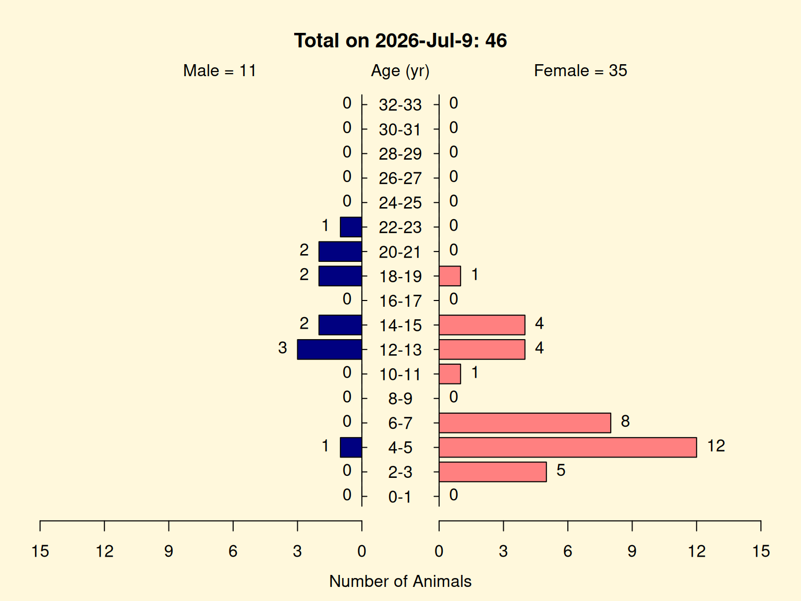
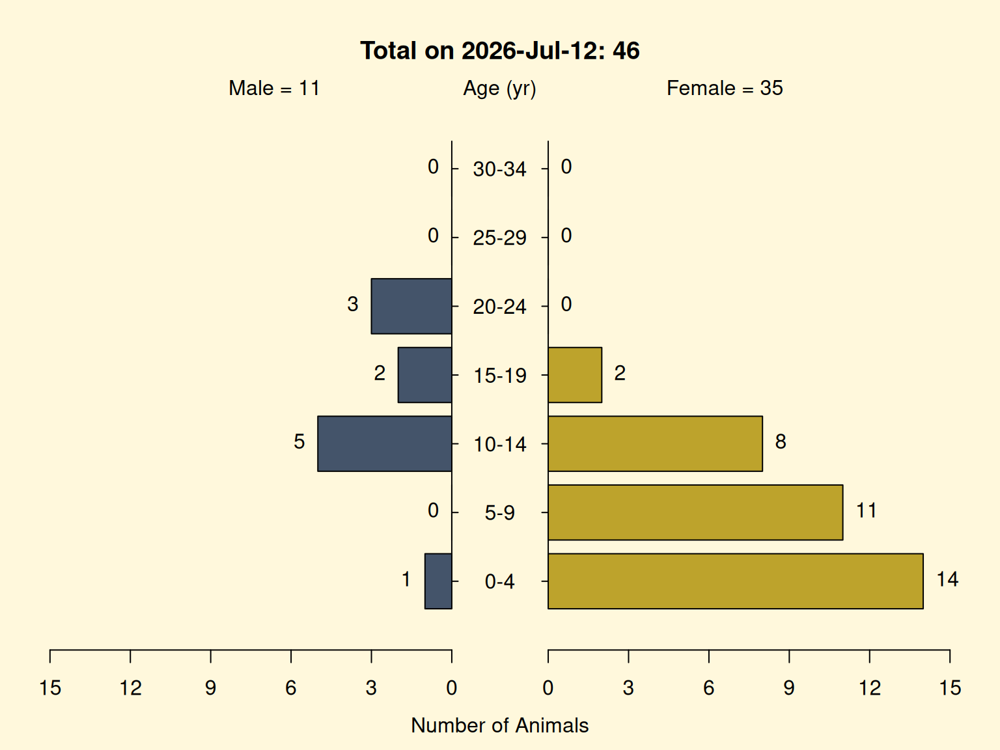

# Age-Sex Pyramid Plots

## Overview

An **age-sex pyramid** is the standard way to picture a colony’s
demographic structure. Animals are grouped into age bands, and each band
is drawn as a pair of horizontal bars – males to the left, females to
the right – so the length of a bar is the number of animals of that sex
in that age band. The shape of the resulting pyramid tells a colony
manager at a glance how many animals sit in each age cohort, whether the
sexes are balanced, how many animals are of breeding age, and whether
the colony is growing (a wide young base) or aging (a narrow base
beneath a heavy middle).

[`getPyramidPlot()`](https://github.com/rmsharp/nprcgenekeepr/reference/getPyramidPlot.md)
draws this plot from a pedigree. It uses the **living** animals (those
with no exit date) that have a known age, and labels the figure with the
plotted count and the date it was drawn. This article builds a pyramid
from the `qcPed` data set that ships with the package; in practice you
would first run the studbook through
[`qcStudbook()`](https://github.com/rmsharp/nprcgenekeepr/reference/qcStudbook.md)
(see the *Studbook Quality Control* article) so the sexes, dates, and
ages are clean.

## Setup

``` r

library(nprcgenekeepr)
```

[`getPyramidPlot()`](https://github.com/rmsharp/nprcgenekeepr/reference/getPyramidPlot.md)
draws with base graphics (via
[`plotrix::pyramid.plot()`](https://plotrix.github.io/plotrix/reference/pyramid.plot.html)),
so each plotting call is the last expression in its code chunk. It runs
no random simulation, and `qcPed` ships with a fixed `age` column, so
the pyramid’s *shape* is reproducible; only the date in the title –
which is “today” when the plot is drawn – changes between renders. No
[`set_seed()`](https://github.com/rmsharp/nprcgenekeepr/reference/set_seed.md)
is needed.

## A first pyramid

`qcPed` is a 280-animal example pedigree. The pyramid is built from its
living, aged animals:

``` r

c(total   = nrow(qcPed),
  living  = sum(is.na(qcPed$exit)),
  plotted = sum(is.na(qcPed$exit) & !is.na(qcPed$age)))
#>   total  living plotted 
#>     280      89      46
```

``` r

getPyramidPlot(qcPed)
```



Of the 280 animals, 89 are living (no exit date), and 46 of those have a
recorded birth date – and therefore a computable age – so 46 is what the
pyramid places. The title reports that plotted total and the date the
plot was drawn; the side labels give the male and female totals.

The gap between 89 living and 46 plotted is itself worth noticing: the
other **43 living animals have no birth date**, so they have no age and
cannot be placed – and here they are *all male*. That badly distorts the
picture. The plot shows 35 females to 11 males (about three to one
female), but the living colony is actually **male-majority** – 54 males
to 35 females. The apparent skew is not merely exaggerated, it is
*reversed*. A pyramid only shows animals it can age, so missing birth
dates can quietly invert it – a strong reason to quality-control the
studbook first.

## Reading the pyramid

Read each age band as a left/right pair: the left bar is the count of
males in that band, the right bar the count of females. Stacking the
bands youngest-at-the-bottom gives the demographic profile:

- a **wide base** (many animals in the youngest bands) means strong
  recruitment; a **narrow base** signals few young animals and a coming
  gap;
- the **breeding-age bands** (bars in the reproductive age range) show
  how many potential breeders are available, by sex;
- a **lopsided** pyramid – one sex’s bars consistently longer – flags a
  sex imbalance, though (as above) confirm it is real and not an
  artifact of animals that could not be aged.

## Options

`binWidth` sets the age-band width: narrow bins show fine cohort
structure, wide bins smooth it. `colorScheme = "viridis"` switches to a
colorblind-friendly palette.

``` r

getPyramidPlot(qcPed, binWidth = 5, colorScheme = "viridis")
```



`ageUnit = "months"` is useful for young or short-lived cohorts (the
bands and the title switch to months), and `showCounts = FALSE` hides
the per-bar counts for a cleaner figure.

## Key arguments

| Argument | Default | Meaning |
|----|----|----|
| `ped` | – | pedigree with at least `sex` and `age` columns (plus `exit` to select living animals) |
| `binWidth` | `2` | width of each age band, in `ageUnit`s |
| `ageUnit` | `"years"` | `"years"` or `"months"` |
| `colorScheme` | `"default"` | `"default"` (blue/pink) or `"viridis"` (colorblind-friendly) |
| `showCounts` | `TRUE` | print the count on each bar |
| `ageLabelCex` | `1.0` | size of the age-band labels |

## See also

- The **Studbook Quality Control** article – clean the studbook (sexes,
  dates, birth records) with
  [`qcStudbook()`](https://github.com/rmsharp/nprcgenekeepr/reference/qcStudbook.md)
  before plotting, so the pyramid reflects the whole living colony.
- The **Building a Focal-Animal Pedigree Offline** article – build a
  focal-animal pedigree from files with no database, via
  [`getFocalAnimalPedFromFile()`](https://github.com/rmsharp/nprcgenekeepr/reference/getFocalAnimalPedFromFile.md).
- The **Genetic Value Analysis** article – rank a quality-controlled
  pedigree by mean kinship and genome uniqueness with
  [`reportGV()`](https://github.com/rmsharp/nprcgenekeepr/reference/reportGV.md).
- The **Forming Breeding Groups** article – assemble genetically diverse
  breeding groups with
  [`groupAddAssign()`](https://github.com/rmsharp/nprcgenekeepr/reference/groupAddAssign.md).
- [`getPyramidPlot()`](https://github.com/rmsharp/nprcgenekeepr/reference/getPyramidPlot.md)
  – the function documented here.
- [`runGeneKeepR()`](https://github.com/rmsharp/nprcgenekeepr/reference/runGeneKeepR.md)
  – the Shiny app, whose Age-Sex Pyramid tab draws this plot
  interactively.

**Reference.**

The age-sex pyramid is a standard demographic visualization; the plot
here is drawn with
[`plotrix::pyramid.plot()`](https://plotrix.github.io/plotrix/reference/pyramid.plot.html).
The package itself derives from Vinson A, Raboin MJ (2015). “A Practical
Approach for Designing Breeding Groups to Maximize Genetic Diversity in
a Large Colony of Captive Rhesus Macaques (*Macaca mulatta*).” *Journal
of the American Association for Laboratory Animal Science*
54(6):700-707.
