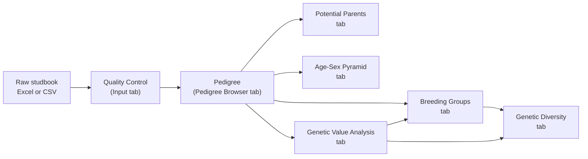

# Purpose, Approach, and a Colony Manager’s Guide to Practice

## Abstract

`nprcgenekeepr` provides genetic tools for primate-colony management:
studbook quality control, pedigree construction and browsing, age-sex
demographic display, genetic value analysis, and breeding-group
formation, delivered through both a Shiny application
([`runGeneKeepR()`](https://github.com/rmsharp/nprcgenekeepr/reference/runGeneKeepR.md))
and an exposed R API. This article is a practical,
screenshot-illustrated guide for colony managers and primate-center
bioinformatics staff, complementing the engineering account in
[“Engineering nprcgenekeepr
2.0.0”](https://github.com/rmsharp/nprcgenekeepr/articles/engineering-the-2.0.0-release.md)
and the six feature-depth articles listed in [Section 4](#sec-approach).
Section 1 explains why the package exists; Section 2 maps its five
function groups onto the app’s tabs and onto the two ways to use them
(point-and-click or scripted); Section 3 walks a colony manager through
the entire application, tab by tab, using the package’s own shipped
example pedigree. This article’s own preparation surfaced and fixed
three production issues along the way – an Excel-upload defect that
could silently corrupt sire/dam IDs, a “Custom” breeding-group sex ratio
option with no numeric input, and a shipped example pedigree missing a
column the Potential Parents tab needs to demonstrate populated results
– each described where it arose rather than glossed over. All claims in
this article are current as of 2026-07-17.

## Introduction

This article is an onboarding guide to `nprcgenekeepr` for the audience
it was built for: primate-center bioinformatics staff and colony
managers evaluating or learning to use the package. It answers three
questions in order – **why** the package exists, **how** its
capabilities are organized, and **what it looks like to actually use
it** – using the Shiny application
([`runGeneKeepR()`](https://github.com/rmsharp/nprcgenekeepr/reference/runGeneKeepR.md))
as the walkthrough’s frame of reference.

It is one of three documents that together cover the package from
different angles. [“Engineering nprcgenekeepr
2.0.0”](https://github.com/rmsharp/nprcgenekeepr/articles/engineering-the-2.0.0-release.md)
documents the modular-architecture migration and development process
behind the current application – read it for the *how it was built*
story. Six shorter feature articles (linked from
[Section 4](#sec-approach)’s table) each walk one capability in depth,
directly through the R API rather than the Shiny app. This article does
neither of those jobs: it is the practical, tab-by-tab guide to *using*
the application as shipped, aimed at a reader who wants to load a
pedigree and get results, not read source code.

**Scope.** Every claim below describing the current application – tab
list, control labels, default values, and any number tied to the
package’s own `data(examplePedigree)` example data – was re-verified
directly against the source and a live run of the app, as of 2026-07-17.
Nothing here is carried forward uncritically from earlier tutorials.

## Section 1 – Purpose: Why nprcgenekeepr Exists

The goal of `nprcgenekeepr` is to implement genetic tools for colony
management. It was initially conceived and developed as a Shiny web
application at the Oregon National Primate Research Center (ONPRC) to
facilitate analyses that center routinely performs, and has since been
enhanced so that its underlying functions can also be used directly in R
scripts rather than only through the Shiny interface (see
[Section 4](#sec-approach)’s “two ways to use them”).

Captive breeding colonies – rhesus macaques and other nonhuman primates
at National Primate Research Centers – need to manage genetic diversity
across generations: avoiding the mating of closely related animals,
preserving rare alleles carried by relatively few individuals, and
forming breeding groups that balance those genetic goals against real
behavioral and housing constraints. `nprcgenekeepr`’s ranking and
grouping methodology follows Vinson and Raboin (2015), *A Practical
Approach for Designing Breeding Groups to Maximize Genetic Diversity in
a Large Colony of Captive Rhesus Macaques (Macaca mulatta)*, *Journal of
the American Association for Laboratory Animal Science*, 54(6), 700-707.

This work has been supported in part by NIH grants P51 RR13986 to the
Southwest National Primate Research Center and P51 OD011092 to the
Oregon National Primate Research Center.

## Section 2 – Approach: The Five Function Groups and Two Ways to Use Them

`nprcgenekeepr`’s capability is organized around five function groups.
Each maps onto one or more tabs in the Shiny application (walked in
[Section 5](#sec-practice)) and, for readers who want to script rather
than click, onto a feature article that demonstrates the same underlying
functions directly through the R API.

| \# | Function group | App tab(s) | Read deeper (R-API walkthrough) |
|----|----|----|----|
| 1 | Quality control of studbooks | Input | [Studbook Quality Control](https://github.com/rmsharp/nprcgenekeepr/articles/studbook-quality-control.md) |
| 2 | Pedigree construction and browsing, including identifying candidate parents for animals with unknown parentage | Pedigree Browser, Potential Parents | [Building a Focal-Animal Pedigree Offline](https://github.com/rmsharp/nprcgenekeepr/articles/offline-focal-animal-workflow.md) |
| 3 | Age-sex demographic display | Age-Sex Pyramid | [Age-Sex Pyramid Plots](https://github.com/rmsharp/nprcgenekeepr/articles/age-sex-pyramid.md) |
| 4 | Genetic value analysis (mean kinship, genome uniqueness) | Genetic Value Analysis, Genetic Value Analysis and Breeding Group Description | [Genetic Value Analysis](https://github.com/rmsharp/nprcgenekeepr/articles/genetic-value-analysis.md); [Validating the Founder-Genome-Equivalent Standard Error](https://github.com/rmsharp/nprcgenekeepr/articles/fg-se-validation.md) |
| 5 | Breeding-group formation and ongoing diversity monitoring | Breeding Groups, Genetic Diversity | [Forming Breeding Groups](https://github.com/rmsharp/nprcgenekeepr/articles/breeding-group-formation.md) |

Table 1: Function groups, the app tabs that expose them, and the
companion articles that demonstrate them via the R API.

The Genetic Diversity and Potential Parents tabs (rows 2 and 5) are
recent additions that extend two of the five original groups rather than
constituting new ones: Potential Parents extends pedigree construction
by proposing candidate parents for animals recorded with unknown
parentage; Genetic Diversity extends breeding-group formation by
monitoring the diversity of groups once they are formed. Both are
covered in [Section 5](#sec-practice) alongside the tabs they extend.

These five groups compose into one pipeline, from a raw studbook to
formed breeding groups:



**Two ways to use it.** Everything in this pipeline is available both
through the Shiny application walked in [Section 5](#sec-practice) and
as directly callable R functions – `NAMESPACE` exports 182 functions as
of 2026-07-17. An open GitHub issue
([\#37](https://github.com/rmsharp/nprcgenekeepr/issues/37)) tracks,
function by function, which exports the Shiny app itself exercises
versus which exist primarily for scripted or batch workflows; its own
most recent re-verification (2026-06-16) predates the current export
count, so treat its exact split as directional rather than a precise
current figure. The practical takeaway for this article’s audience: if a
task in [Section 5](#sec-practice) feels like it should be scriptable –
batch-processing several pedigrees, or running a workflow without a
browser – it very likely already is; the six feature articles in
[Table 1](#tbl-function-groups) are worked examples of exactly that.

## Section 3 – Practice: A Colony Manager’s Walkthrough

This section walks every tab of the Shiny application in order, using
the package’s own shipped example data (`data(examplePedigree)`,
`data(focalAnimals)`) throughout so every step below is reproducible.
Start the application with:

``` r

library(nprcgenekeepr)
runGeneKeepR()
```

([`runModularApp()`](https://github.com/rmsharp/nprcgenekeepr/reference/runModularApp.md)
also still launches the application but is deprecated in favor of
[`runGeneKeepR()`](https://github.com/rmsharp/nprcgenekeepr/reference/runGeneKeepR.md).)
The complete online documentation, including the function reference and
this article’s companions, is at
<https://rmsharp.github.io/nprcgenekeepr/>.


The Home tab, the application’s landing page, with quick links to each
major tab.

### Uploading a Pedigree File

The **Input** tab’s “Input Format” sub-tab documents the exact file
formats and column requirements accepted – consult it directly rather
than a description here, since it is kept in sync with the package’s
actual reader code and this article is not.


The Input tab’s “Input Format” documentation sub-tab.

Choose a **File Type** (Excel or Text) and a **File Content** option –
pedigree only, pedigree and genotypes together or in separate files, or
focal animals only (built from a database connection or, offline, from a
second uploaded pedigree file) – then browse for the file itself.

> **Note**
>
> **Fixed before publication.** An earlier draft of this walkthrough
> found that uploading an Excel workbook shaped like the package’s own
> shipped example pedigree (several placeholder-parent rows before
> alphanumeric IDs) silently corrupted the sire/dam columns: `readxl`
> inferred those columns’ type from the early blank rows, guessed
> `logical`, and converted every later alphanumeric ID it could not
> parse as logical to `NA` – with no warning surfaced to the user. This
> affected the same upload path any Excel-format pedigree goes through,
> not just this example file. **Fixed** by routing the Excel read
> through the same `col_types = "text"` helper the package’s other Excel
> readers already use, so both CSV and Excel now round-trip correctly.
> This walkthrough continues to use CSV below for simplicity, not to
> work around any remaining defect.


The Input tab’s file-selection sidebar, before a file is chosen.

``` r

makeExamplePedigreeFile(fileType = "csv")
```


After selecting the example pedigree file.

Two optional fields, **Minimum Sire Age** and **Minimum Dam Age**, are
each left blank by default so that a species- and sex-specific
breeding-age default is used automatically; type a number in either
field to override that sex’s floor (for macaques, which may reproduce as
early as two years of age, a value of 2 is appropriate for both).


Minimum sire and dam age fields filled in.

Selecting **Read and Check Pedigree** reads the file and validates it –
checking that every required column is present and that the pedigree is
internally consistent (parent-of-the-right-sex, no duplicate IDs, valid
dates, and more; the full set of checks is listed below). Results appear
on the “QC Summary” sub-tab. For the shipped example pedigree read as
CSV, this reports **Records Processed: 3,694, Errors: 0, Warnings: 1**.


QC Summary after reading and checking the example pedigree.

| Error | Definition |
|:---|:---|
| failedDatabaseConnection | Database connection failed: configuration or permissions are invalid. |
| missingColumns | Columns that must be within the pedigree file are missing. |
| invalidDateRows | Values that are supposed to be dates cannot be interpreted as a date. |
| suspiciousParents | A parent was too young, on the offspring’s birth date, to plausibly be the parent. |
| femaleSires | Individuals listed as female or hermaphroditic and also as a sire. |
| maleDams | Individuals listed as male and also as a dam. |
| sireAndDam | Individuals listed as both a sire and a dam. |
| duplicateIds | IDs listed more than once. |
| invalidIdChars | IDs (id, sire, or dam) containing a disallowed period (‘.’); IDs must be alphanumeric with no symbols. |
| changedCols | Columns renamed to conform to internal naming conventions, and what they were changed to. |

QC error types checked by Read and Check Pedigree. {.table .caption-top}

### Pedigree Browser

The **Pedigree Browser** tab displays the pedigree in a paged table (10,
25, 50, or 100 rows at a time) with a **Display Unknown IDs** option.
Unknown IDs (UIDs) are placeholder IDs the application generates, by
default starting with the letter U, for the unrecorded parent of an
animal with only one known parent.


Pedigree Browser with Display Unknown IDs checked (the default).

Unchecking **Display Unknown IDs** removes those placeholder rows. For
the example pedigree, the row count reduces from **3,694 to 2,322** –
the difference, 1,372, is the number of UNKNOWN placeholder animals the
application generated to stand in for unrecorded parents.


Pedigree Browser with Display Unknown IDs unchecked.

**Focal animals.** The middle panel lets you narrow the browser to a
subset of the pedigree – your *focal animals* – either by typing IDs
directly or by uploading a CSV file of IDs.


The Focal Animals panel, before any IDs are entered.

Typing five IDs (`FJS7RQ, H6T2FF, HEVL3L, I04JZV, S63QDN`), unchecking
**Display Unknown IDs**, checking **Trim pedigree based on focal
animals**, and selecting **Update Focal Animals** keeps only those five
animals and their ancestors and descendants – **54 animals** in total
for this example.


The Pedigree Browser trimmed to 5 focal animals and their relatives (54
animals total).

A larger focal-animal list works the same way. The package ships a
second example object, `data(focalAnimals)`, with 327 IDs; uploading it
as a CSV via **Choose CSV file with focal animals** and trimming keeps
those animals plus everyone needed to connect them – **962 animals** in
total.


Uploading a larger focal-animal list (the shipped `focalAnimals`
example, 327 IDs).


Trim pedigree option selected, before clicking Update.


The pedigree trimmed to the larger focal group (962 animals total).

Checking **Clear Focal Animals** and selecting **Update Focal Animals**
again reads an empty ID list, restoring the full, untrimmed pedigree.


Before clearing the focal-animal list.


After clearing the focal-animal list – the full pedigree is restored.

A population must be defined here before proceeding to Genetic Value
Analysis. The rest of this walkthrough continues with the **full,
untrimmed** example pedigree (the focal-animal trim above illustrates
the feature, not the population used for the remaining tabs) – matching
the shipped `examplePedigree`’s own downstream numbers below.

**Diagram view.** Alongside the table, the Pedigree Browser’s
**Diagram** tab renders the same population as an interactive pedigree
diagram: one node per animal, shaped by sex, with directed sire/dam
edges laid out top-down by generation. A legend to the right of the
diagram shows what each shape means. If the pedigree data includes an
optional `affected` column, individuals marked affected are additionally
shaded a distinct color, with a matching “Affected” entry in the same
legend – pedigrees without an `affected` column render unshaded, as
before. If the pedigree data includes an optional `name` column, a
**Show Names on Diagram** toggle above the diagram (off by default)
switches each node’s label from id-only to id plus name on a second line
– a name longer than 15 characters is truncated with an ellipsis on the
diagram itself, with the full name always available in the hover
tooltip. Not every animal needs a name; one with no name, or a pedigree
with no `name` column at all, always renders with just its id, and the
“Select by id” search dropdown below always lists ids, never names,
regardless of the toggle.


The Pedigree Browser Diagram tab with its shape-to-sex legend.

Diagrams render up to **750 animals** – for larger populations, narrow
the focal-animal selection first (see **Focal animals** above). Hovering
any node shows its ID, sex, generation, sire, dam, and (when present)
affected status without leaving the diagram. Clicking a node re-centers
the population on that animal, the same as typing its ID into the
focal-animals text area above – a quick way to explore a different
branch of the pedigree. A **Select by id** dropdown above the diagram
lets you jump straight to one animal by ID, dimming every other node
except it and its direct connections – useful for finding one animal in
a large, busy diagram. An **Export Diagram (PNG)** button in the
diagram’s own corner saves the current view as an image file, useful for
husbandry reports, IACUC documents, or presentations.

### Age-Sex Pyramid

The **Age-Sex Pyramid** tab displays a standard population pyramid for
whichever pedigree population is currently selected in Pedigree Browser,
with options for age units, color scheme, and whether to show counts.
For the full example pedigree, it shows **332 living animals** (123
male, 209 female).


The Age-Sex Pyramid for the full example pedigree (332 living animals).

### Genetic Value Analysis

The **Genetic Value Analysis** tab ranks animals by relative breeding
value, using mean kinship (how inter-related an animal is with the rest
of the current breeding population – lower is better) and genome
uniqueness (how likely an animal carries alleles that are rare in the
colony and at risk of being lost – higher is better). See the **Genetic
Value Analysis and Breeding Group Description** tab for the full
calculation breakdown.

Genome uniqueness is estimated by a gene-drop simulation (MacCluer et
al. 1986; Ballou and Lacy 1995): unique alleles are assigned to every
pedigree founder and simulated forward through the pedigree according to
Mendelian rules. Because it is an estimate, each value carries a
sampling standard error (the `guSE` column) that shrinks roughly with
the square root of the iteration count – but what actually matters for
breeding decisions is whether the *ranking order* has stabilized, not
just whether `guSE` is small. The default is **1,000 iterations**, which
experience with the pedigrees this package has been used on gives a
stable selection order; to check whether 1,000 is enough for a specific
pedigree, run
[`gvaConvergence()`](https://github.com/rmsharp/nprcgenekeepr/reference/gvaConvergence.md)
(see the *Gene-Drop Iteration Convergence* vignette,
[`vignette("gvaConvergence", package = "nprcgenekeepr")`](https://github.com/rmsharp/nprcgenekeepr/articles/gvaConvergence.md)).

An optional **Kinship Overrides** panel accepts a CSV or Excel file of
outside-information kinship values (columns `id1`, `id2`, `kinship`) for
specific pairs – for example, genotype-confirmed relatedness that
disagrees with the pedigree. Overrides apply to rankings, breeding
groups, and summary statistics regardless of tab order, though the
Summary Statistics relationship *label* stays pedigree-derived even when
its displayed value is overridden.


Genetic Value Analysis, ready to run (1000 iterations, threshold 4,
Kinship Overrides panel visible).

Selecting **Run Analysis** starts the gene-drop process. When it
completes, a results table shows each animal’s rank, mean kinship,
genome uniqueness, and a `value` column classifying it as High Value,
Low Value, or Undetermined. “Show top N” and an ID filter control how
many rows are displayed.


Genetic Value Analysis results, default view (top 20).

**A correction to an older claim.** Animals with no recorded parentage
(“Undetermined” – typically imports or very young animals not yet
assigned parents) are *not* automatically high value. Since issue \#9’s
ranking correction (`R/modGeneticValue.R:289-301`), the results table
sorts Undetermined animals to the *bottom* of the ranking, so a
genuinely uncertain genome-uniqueness estimate no longer inflates them
to the top. Because the exact row at which values transition from High
to Low is a property of one stochastic gene-drop run, this article does
not pin a specific row number to it – widening “Show top N” (to 500
below) shows the full distribution instead.


Genetic Value Analysis results widened to show more of the ranking,
including lower-ranked and Undetermined animals.

### Summary Statistics

The **Summary Statistics and Plots** tab uses the results from Genetic
Value Analysis. Definitions of genome uniqueness and kinship are on the
**Genetic Value Analysis and Breeding Group Description** tab;
founder-equivalent and founder-genome-equivalent definitions are at the
bottom of this tab (see also [“Validating the Founder-Genome-Equivalent
Standard
Error”](https://github.com/rmsharp/nprcgenekeepr/articles/fg-se-validation.md)).


Summary Statistics, first view.

The tab has several export buttons producing CSV files, three of which
are illustrated below (opened in a spreadsheet program, not captured
from the app itself, since these depict exported file contents rather
than application UI): **Export Kinship Matrix**, **Export First-Order
Relationships**, and **Export Female Founders** (a separate **Export
Male Founders** button produces the same column structure for males).
The tab also has **Export All Relationships** and **Export Relationship
Classes** buttons, plus six further buttons for exporting the six
summary plots below as PNGs, not illustrated here:

- The kinship matrix has a row and column for every analyzed individual,
  plus a first row and first column of IDs.

  

  First few rows of an exported kinship matrix CSV.

- The first-order relationships file has columns `id`, `parents`,
  `offspring`, `siblings`, and `total`, counted from known
  relationships.

  

  First few rows of an exported first-order-relationships CSV.

- The founders files have columns `id`, `sire`, `dam`, `sex`, `gen`,
  `birth`, `exit`, `age`, `ancestry`, `origin`, `status`,
  `recordStatus`, `population`, and `pedNum`.

  

  First few rows of an exported female-founders CSV.

Six plots – histograms and boxplots of kinship coefficients, their
Z-scores, and genome uniqueness scores – are shown together and can each
be exported as a PNG.


All six summary plots together.


One exported plot: the mean kinship coefficient histogram.

### Breeding Group Formation

The **Breeding Groups** tab forms candidate breeding groups from a
source population you choose (top-ranked animals from Genetic Value
Analysis, an uploaded list, or all available animals), subject to a
maximum kinship threshold, a target number of groups, and a minimum
breeding age.


Breeding Group Formation, initial configuration.

Selecting **Form Groups** with the number of groups set to 1 produces a
single group under the **Groups** sub-tab.


One breeding group formed.

**Sex ratio.** Three options control how each group’s sex composition is
constrained:

- **None** – sex is not considered when filling groups.
- **Harem (1M:NF)** – each group is seeded with a single male and filled
  with females.
- **Custom** – a “Custom ratio (F per M):” numeric field appears
  (default 1.0, range 0.5-20.0) targeting an arbitrary females-per-male
  ratio.

> **Note**
>
> **Fixed before publication.** An earlier draft of this walkthrough
> found selecting “Custom” gave no way to enter the desired ratio
> anywhere in the UI – internally it was treated the same as “None.”
> **Fixed** by adding the numeric field described above; group formation
> now uses that value as the target ratio.

The screenshot below shows one working example: the default 20
top-ranked candidate animals, a target ratio of 2.5 females per male,
and “Number of groups” set to 6. Because group formation is a randomized
search (the default **Number of simulations** is 10), the exact number
and composition of groups formed varies from run to run rather than
reproducing identically – this particular run produced 7 groups, each
drawn toward the target ratio where enough candidates of each sex were
available.


Breeding groups formed with a Custom sex ratio of 2.5 (females per male)
– one run of the randomized search.

**Seeding groups with specific animals.** Behavioral constraints – an
existing social group, or an infant that should stay with its dam – can
be accommodated by checking **Seed groups with specific animals**, which
opens one text area per group for listing the animals that must be
assigned to it; the algorithm fills in the remaining membership around
those seeds. The screenshot below shows the six text areas this creates
for a 6-group run, before any IDs are typed into them.


The six per-group seed text areas (Number of groups = 6), shown empty.

Each formed group’s full membership, and – if **Include kinship in
display of groups** was checked before forming – its within-group
kinship values, can be reviewed on the **Group Detail** sub-tab, one
group at a time.


Group Detail for one formed group (no kinship shown).


Group Detail with kinship values included, viewing a different group of
the same 6-group run.

A **Statistics** sub-tab summarizes all formed groups at once. Groups
and their kinship matrices can each be exported individually to a file
and location you choose.

### Mate Pair Analysis

The **Mate Pair Analysis** tab (issue
[\#151](https://github.com/rmsharp/nprcgenekeepr/issues/151)) is new
since the original tutorial-era documentation. It answers a different
question than the Breeding Groups tab: not “what multi-animal groups
should be formed,” but “for a given, deliberately scoped population,
which individual male/female pairs are even eligible to consider, and
what do we know about each pair” – a curator-facing worksheet, kept
structurally and file-wise separate from group formation.

**Choosing a candidate population.** Unlike group formation, this tab
requires an explicit population scope before it will compute anything –
**All alive** (every animal with no recorded exit date), **Top ranked by
genetic value** (the highest-ranked animals from a completed Genetic
Value Analysis run), or a **Custom list** of pasted IDs. This is a
deliberate, evidence-based design choice, not an arbitrary restriction:
minimum age alone does not bound the candidate table on real colony
data, because a missing recorded age *passes* the age screen rather than
being excluded by it, and a large fraction of animals in a typical
studbook have no recorded age at all. Scoping the population first keeps
the resulting table both meaningful and responsive.

Set the **Minimum breeding age** floor and, optionally, check **Exclude
specific animals** to open a text area for animals that should never
appear in a pair regardless of any other eligibility screen. Click
**Find Eligible Pairs** to compute the result.


Mate Pair Analysis configuration panel and the Eligible Pairs table for
a small example pedigree scoped to all alive animals.

The **Eligible Pairs** table reports, for every opposite-sex pair
surviving the population, age, and exclude-list screens: pedigree
kinship, and – when a genotype file has already been uploaded on the
Marker Genetics tab – marker-based kinship for that same pair, alongside
each parent’s pedigree-based mean kinship and genome uniqueness (the
same `indivMeanKin`/`gu` values shown on the Genetic Value Analysis
tab). No single blended “compatibility score” is computed; sort or
filter the raw columns directly, the same way every other ranked table
in this application works. The table is sortable and filterable
server-side, and its CSV export downloads exactly the rows currently
visible after any filter – not the full, unfiltered table.

A separate **Excluded** tab shows every pair the age or exclude-list
screen dropped, together with its reason, so a curator can see *why* a
pair is missing instead of it silently disappearing.


The Excluded tab, showing pairs dropped for being under the minimum age
or explicitly excluded.

A demographically-eligible pair with very high kinship (e.g. full
siblings) is not specially flagged or hidden by this tab – it appears in
the Eligible Pairs table exactly like any other pair, with a high
`kinship` value. That value *is* the signal a curator uses to avoid such
a pairing; this tab surfaces the information rather than making the
decision for them.

### Genetic Diversity

The **Genetic Diversity** tab (issue
[\#112](https://github.com/rmsharp/nprcgenekeepr/issues/112)) is new
since the package’s original tutorial-era documentation. It monitors the
diversity of breeding groups *after* they are formed: once groups exist
(Breeding Groups tab) and a Genetic Value Analysis has been run, it
renders a red/yellow/green heat map with one row per group and one
column per metric – **Value** (the proportion of low-value animals in
the group), **Origin** (Indian- vs. Chinese-origin status, shown only
when the pedigree has an `ancestry` column), **Production** (whether
age-appropriate breeding females are present for the selected **Housing
type**, “Shelter pens” or “Corral”), and **Inbreeding** (within-group
kinship risk involving the group’s male). A group with no assessed
value, or an undefined Inbreeding result, is scored red rather than
shown as healthy, so missing data surfaces instead of hiding as a false
green. Until groups are formed and an analysis has run, the tab shows
guidance instead of an empty plot.


The Genetic Diversity heat map for the 6 breeding groups formed above.

### Marker Genetics

The **Marker Genetics** tab (issue
[\#130](https://github.com/rmsharp/nprcgenekeepr/issues/130)) is new
since the original tutorial-era documentation. Every other analysis in
`nprcgenekeepr` estimates kinship from the recorded pedigree; this tab
estimates kinship directly from a marker genotype panel instead – an
independent check on relatedness that does not depend on the pedigree
being complete or correct, matching how NPRC genetics working groups
already use SNP panels (e.g. Ancestry-Informative-Marker and
Genetic-Management panels) for parentage, kinship, and colony
genetic-management decisions in practice.

Upload a marker genotype file with one row per animal x locus (columns
`id`, `locus`, `allele1`, `allele2` – see the file format guidance on
the tab itself) to compute the **KING-robust** kinship estimator
(Manichaikul et al. 2010), which requires biallelic markers and is
robust to population substructure. The tab displays a per-animal
comparison table: the pedigree-based mean kinship already shown on the
Genetic Value Analysis tab, alongside the new marker-based mean kinship
– letting a colony manager see at a glance where the two estimates agree
or diverge for a given animal.


The Marker Genetics comparison table for a small example
parent/offspring/unrelated trio: pedigree-based mean kinship
(indivMeanKin) alongside marker-based mean kinship (markerMeanKin).

A second **Heterozygosity** tab (also part of issue \#130) surfaces a
related but distinct diagnostic from the same uploaded genotype file:
each animal’s observed heterozygosity (`ho`, the fraction of its
genotyped loci at which it carries two different alleles) alongside the
population’s expected heterozygosity (`he`, Nei’s gene diversity
computed from marker allele frequencies and averaged across loci).
Observed running below expected across the population points toward
inbreeding or population substructure; observed running above expected
points the other way, toward outbreeding.


The Heterozygosity tab for the same example trio: observed
heterozygosity (ho) per animal alongside the population’s expected
heterozygosity (he).

A third **Parentage Exclusion** tab (also part of issue \#130)
cross-references the current pedigree’s recorded dam and sire against
the same uploaded genotype file: for each animal with a genotyped
recorded parent, it counts the marker loci at which the two are
Mendelian-inconsistent (both homozygous for a different allele – no
shared allele is possible) and flags any recorded parent whose genotype
evidence contradicts the pedigree, directly targeting real-world
dam/sire misidentification. A single mismatching locus does not trigger
a flag on its own, since ordinary genotyping error or mutation can
produce an isolated mismatch even for a true parent-offspring pair – the
tab flags a recorded parent only once its exclusion count exceeds a
conservative, tunable tolerance (3 or more inconsistent loci by
default).


The Parentage Exclusion tab: C’s recorded dam (P) is
Mendelian-consistent (0 exclusions, not flagged); C’s recorded sire
(falsely set to the unrelated U) is Mendelian-inconsistent (3
exclusions, flagged).

A fourth **Cross-Center** tab (also part of issue \#130) answers a
different question than the other three: not “how related are these
animals,” but “how genetically differentiated are two separate
colonies.” Upload a second marker genotype file for a second center (the
first uploaded file becomes “Center A”), and the tab computes **Hudson’s
Fst** – a standard allele-frequency differentiation statistic – at every
marker locus genotyped in both centers, plus a single pooled summary
value. A value near zero means the two centers’ allele frequencies at
that locus are essentially indistinguishable; a larger value (Fst can
range up to 1, and can occasionally come out slightly negative due to
sampling noise) means the two populations have drifted apart at that
marker.

Hudson’s estimator was chosen over the more commonly-cited Weir &
Cockerham (1984) estimator specifically because it is not biased by an
imbalance between the two centers’ sample sizes – a real concern here,
since different centers plausibly submit marker panels for different
numbers of animals. The per-locus values are pooled into the single
summary as a *ratio of sums* rather than a simple average, because
averaging per-locus ratios directly is a well-documented source of bias
for this kind of statistic.


The Cross-Center tab comparing two example centers at 2 marker loci:
per-locus Fst (L1, L2) alongside the pooled summary value across both
loci.

A fifth **Candidate Parent Assignment** tab (issue
[\#147](https://github.com/rmsharp/nprcgenekeepr/issues/147)) picks up
directly where the Parentage Exclusion tab leaves off: for every
recorded dam or sire that tab flags as Mendelian-inconsistent, this tab
ranks candidate replacement parents using a **CERVUS-style multilocus
likelihood-ratio (LOD) score** – the same field-standard method already
cited by the Parentage Exclusion tab’s own diagnostic. No new file
upload is needed; the tab reads the same genotype file and pedigree
already loaded for the rest of the module.

For each flagged animal, every demographically-eligible candidate parent
is scored and ranked by `LOD` (higher is more consistent with the
observed genotypes), alongside `delta` (the gap down to the next-best
candidate), `nLociUsed` (how many loci the comparison actually rests
on), `excluded` (whether this specific candidate is itself
Mendelian-inconsistent), and `lowPower` (whether too few loci were
shared to trust the ranking). The tab deliberately does **not** report a
simulation-calibrated percentage confidence – this package’s realistic
marker-panel sizes sit inside the range the underlying literature
documents as underpowered for that kind of claim, so an uncalibrated raw
score is the honest signal to show a curator. Like the Parentage
Exclusion tab, this is a diagnostic only: it never rewrites the
pedigree’s recorded dam or sire, and any change to the colony’s records
remains a curator decision made outside the tool.

> **Note**
>
> **Current limitation.** Candidate lists come from the same demographic
> screening the Potential Parents tab uses (age, sex, presence date,
> gestation window), which only proposes candidates for an animal with
> an *unrecorded* parent slot. An animal whose recorded parent is
> present but wrong – the case this tab exists for – will show no
> candidates unless its *other* parent slot is also unrecorded, or
> unless a curator explicitly supplies a candidate list (a
> script-callable option not yet exposed in this tab). This is being
> tracked as a follow-on improvement.


The Candidate Parent Assignment tab for a small example trio: C’s
falsely-recorded sire (Q) is Mendelian-excluded across all 10 shared
loci, so its LOD score is negative infinity – a true genetic
impossibility, not merely “unlikely” (blank cells in the LOD/delta
columns above render that infinite value).

A sixth **Linkage and LD Block Metrics** tab (issue
[\#153](https://github.com/rmsharp/nprcgenekeepr/issues/153)) answers a
question the other five tabs deliberately don’t: whether nearby marker
loci carry information about relatedness or linkage beyond what each
locus contributes independently. It needs its own dedicated marker
genotype upload (separate from the file used by the other five tabs,
since it tolerates multiallelic panels – e.g. microsatellite/STR panels
– that the other tabs’ biallelic-only KING-robust estimator would
reject) plus a locus metadata file describing each locus’s chromosome,
physical position, and (optionally) genetic-map position.

Uploading the locus metadata file first shows a **coverage report**:
real colony marker panels rarely have complete positional information,
so every locus is classified into one of three explicit tiers – `full`
(chromosome and position both known), `partial` (only one known), or
`none` – rather than silently requiring complete metadata before
anything downstream works.


The Linkage and LD Block Metrics tab’s locus metadata coverage report
for a 12-locus example STR panel: 8 loci have full chromosome+position
information, 2 have partial (chromosome only), and 2 have neither.

Below the coverage report, two complementary metrics are computed. The
**Realized Relatedness Variance** table is the tab’s primary, genuinely
pedigree-valid metric (Hill & Weir 2011): pedigree-based kinship is only
an *average* expected relatedness – the actual proportion of genome
shared identical-by-descent between two relatives varies around that
average because of Mendelian sampling and linkage, and this table
estimates that variance for Parent-Offspring, Full-Sibling, and
Half-Sibling pairs given a curator-supplied chromosome count and total
genetic-map length (pre-filled with rhesus macaque defaults, adjustable
for other species or datasets). It needs no genotype file at all – only
the pedigree already loaded elsewhere in the app.

The **LD Block Statistic** table is a secondary, explicitly-caveated
descriptive measure (D’ and r², computed pairwise for same-chromosome
loci from the multiallelic genotype upload): classical
linkage-disequilibrium theory assumes a randomly-mating population,
which a pedigreed colony violates by construction, and no rigorous
method that is both pedigree-aware and tolerant of multiallelic data
currently exists as a CRAN package. A persistent, non-dismissable banner
states this caveat directly above the table – it always accompanies the
statistic, since this is a genuine, documented limitation rather than an
oversight. An optional checkbox restricts the computation to founder
animals only, which reduces (but does not eliminate) the effect of
related individuals in the sample.


The LD Block Statistic table for the same example STR panel: two
same-chromosome locus pairs (STR01 x STR02 on chromosome 1, STR03 x
STR04 on chromosome 2), each with its D’/r² values and the persistent
caveat banner above.

Because a joint, multi-locus statistic like an LD-block table carries
*more* re-identifying power than a single-locus summary (not less), any
exported LD-block table is de-identified and routed through the same
curator confirm-gate pattern as the De-Identified Export tab below:
generate a preview, confirm via a modal dialog, then download. The
Realized Relatedness Variance table has no export control – like the
other five Marker Genetics tabs, it is a report-only, on-screen
diagnostic.

A seventh **Genomic ROH (F_ROH)** tab (issue
[\#152](https://github.com/rmsharp/nprcgenekeepr/issues/152), the final
slice, closing that issue) computes a marker-based inbreeding estimate
independent of the recorded pedigree: the genomic inbreeding coefficient
F_ROH, derived from Runs of Homozygosity (ROH) – long stretches of
consecutive homozygous loci that are unlikely to occur by chance and
typically indicate the two chromosome copies at that stretch are
identical by descent. Unlike the Linkage and LD Block Metrics tab above,
this one needs **no separate upload**: it reuses the same genotype file
already uploaded for the Kinship Comparison tab (now validated by a rule
set sized for larger, sequence-scale panels) and the same locus metadata
file already uploaded for the Linkage and LD Block Metrics tab, since
both tabs share the same `locus`/`chrom`/`pos` vocabulary by design.

A run of consecutive homozygous, non-missing loci (ordered by physical
position along each chromosome) qualifies as an ROH segment only if it
meets *both* a minimum SNP-count threshold and a minimum base-pair span
threshold – the same field-standard dual-threshold convention PLINK
uses, adjustable via the two fields above the table (pre-filled with
PLINK’s own defaults). F_ROH is the proportion of the genome covered by
qualifying segments.


The Genomic ROH (F_ROH) tab computed on the bundled 50-individual,
1,000-locus synthetic sequence-scale example panel, with the minimum-SNP
threshold lowered from its default of 50 to 3 so the small synthetic
panel still yields non-trivial segments: per-individual segment counts,
total ROH length, and F_ROH.

Like the Linkage and LD Block Metrics tab, any export from this tab is
de-identified and routed through the same curator confirm-gate pattern:
generate a preview, confirm via a modal dialog, then download. Three
artifacts are available – the de-identified genotype matrix, the
de-identified F_ROH table, and a transformation manifest recording the
export’s own timestamp, package version, and the SNP-count/base-pair
thresholds used, mirroring the De-Identified Export tab’s own manifest
convention below.

### Cross-Center Identity

The **Cross-Center Identity** tab (issue
[\#149](https://github.com/rmsharp/nprcgenekeepr/issues/149)) addresses
a different problem than any other tab: a colony animal transferred
between centers is often recorded twice, once under each center’s own id
namespace, so the transferred animal shows up at the receiving center as
an artificial founder – its real parents, known at the origin center,
are lost from every downstream analysis. This tab operationalizes a
*reviewed* fix: a curator uploads both centers’ pedigrees plus their own
explicit id-mapping table (which id at Center A is the same physical
animal as which id at Center B), and the tool safely merges the two
records, restoring the real lineage. Like every other identity-sensitive
feature in `nprcgenekeepr`, this tool never guesses identity from
matching id strings or genetic data – only the mapping a curator
explicitly supplies is ever merged.

The workflow has three steps, each its own tab:

1.  **Validation.** Upload Center A’s pedigree, Center B’s pedigree, and
    the mapping file (columns `idA`/`idB`), then click **Validate
    Mapping**. Every problem is surfaced at once – not just the first
    one found – so a mapping file with several unrelated mistakes (a
    duplicate mapping row, an id that doesn’t exist in either pedigree,
    an id present at both centers but never declared in the mapping, or
    two centers recording different parents for the same mapped animal)
    can be fixed in one pass instead of being rejected and resubmitted
    repeatedly.
2.  **Preview.** Once the mapping validates clean, this tab computes the
    actual proposed merge and shows a lineage-change table: for each
    mapped pair, both centers’ originally-recorded sire/dam alongside
    the resolved sire/dam and which center’s record it came from.
    Clicking **Confirm Merge** opens a confirmation dialog summarizing
    the mapped-pair and final-merged-row counts before anything is
    unlocked for export.
3.  **Export.** Once confirmed, five artifacts become downloadable: the
    Merged Pedigree itself, an echo of the confirmed Mapping, the
    Validation Results (useful as an audit artifact even when clean –
    proof no problems were found), the Merge Summary (the same
    lineage-change table from the Preview tab), and a Provenance record
    (timestamp, the three uploaded file names, package version, and
    per-merged-animal source counts).

This is a standalone review/export tool: the merged pedigree is a
downloadable CSV, not automatically fed into the rest of the
application. A curator who wants the merged result to drive genetic
value, breeding-group, or diversity analysis re-uploads the exported
“Merged Pedigree” file through the Input tab’s existing pedigree-file
path.

### De-Identified Export

The **De-Identified Export** tab (issue
[\#150](https://github.com/rmsharp/nprcgenekeepr/issues/150)) supports
approved external data sharing: producing a relationship-preserving,
de-identified copy of the pedigree already loaded in the current
session, without a separate upload. It reuses the package’s existing,
already-tested de-identification primitives
([`obfuscateId()`](https://github.com/rmsharp/nprcgenekeepr/reference/obfuscateId.md),
[`obfuscateDate()`](https://github.com/rmsharp/nprcgenekeepr/reference/obfuscateDate.md),
[`obfuscatePed()`](https://github.com/rmsharp/nprcgenekeepr/reference/obfuscatePed.md))
rather than any new anonymization logic.

The workflow has two steps:

1.  **Configure & Preview.** Set the alias-id length, the maximum date
    shift (in days), and whether each individual’s dates should shift
    together (**linked**, the recommended default) or independently.
    Linked shifting preserves an individual’s exact inter-date gaps
    (e.g. birth-to-exit) – independent shifting can, on a short-lived
    individual, invert that order and produce a negative recomputed age;
    this is why linked shifting is the default, not merely an option.
    Clicking **Generate Preview** shows the full de-identified output
    before anything is exported, so a curator sees exactly what would
    leave the building. Displayed ages are recomputed from the shifted
    dates, not the original recorded values.
2.  **Export.** Clicking **Confirm Export** opens a dialog carrying an
    explicit institutional-responsibility disclaimer – this app’s first
    – making clear that de-identification is not authorization:
    confirming your institution’s data-sharing policies permit the
    export and its intended recipient(s) remains the curator’s own
    responsibility, not the tool’s. Once confirmed, three artifacts
    become downloadable: the de-identified pedigree itself, a
    transformation manifest (the parameters used, row count, and
    timestamp – never the id map or any raw pre-obfuscation value, so it
    is safe to attach as evidence of *how* an export was produced
    without revealing *what* it replaced), and a distinctly labeled
    **re-identification key** (“DO NOT SHARE”) mapping each alias back
    to its original id. The key downloads as its own, separately labeled
    file so it is never mistaken for a shareable artifact.

Fields outside id, dam, sire, dates, and name (e.g. `origin`, `status`)
pass through unchanged – disclosed in both the warning text and the
manifest, not silently scrubbed, since scrubbing them was never part of
this tool’s scope. As with Cross-Center Identity above,
“curator-controlled” here means a confirmation dialog and warning text,
not real access control: this package has no user-identity or role
infrastructure to enforce authorization against, and inventing one was
explicitly out of scope for this feature.

### Potential Parents

The **Potential Parents** tab (issue
[\#48](https://github.com/rmsharp/nprcgenekeepr/issues/48)) is also new
since the original tutorial-era documentation. It proposes candidate
sires and dams for in-colony animals recorded with at least one unknown
parent, screening candidates by estimated conception date (birth date
minus a **Maximum Gestational Period** in days – prefilled from the
pedigree’s recorded species, e.g. 210 days for rhesus, and adjustable)
and by the same minimum sire/dam breeding ages set on the Input tab.
Results are shown in a sortable table and downloadable as CSV.

> **Note**
>
> **Fixed before publication.** An earlier draft of this walkthrough
> found the shipped `data(examplePedigree)` had no `fromCenter`
> (colony-origin) column, which this feature requires to identify which
> animals are in-colony candidates versus animals whose origin is
> unrecorded – so this section could only show the application’s own
> correctly-degraded empty-result response rather than a populated
> example. **Fixed** by deriving a real `fromCenter` column for the
> shipped example pedigree from its existing `origin`/`recordStatus`
> fields; the screenshot below now shows real results. If your own
> pedigree is missing this column, you will see that same
> correctly-degraded response instead of the populated table below.

Selecting **Find Potential Parents** against the full example pedigree
reports “Found candidate parents for **1,587** animal(s) with at least
one unknown parent,” in a sortable, paginated, CSV-downloadable table.


Potential Parents results for the full example pedigree (1,587 animals
with at least one candidate parent found).

## Conclusion

This article covered why `nprcgenekeepr` exists, how its five function
groups map onto the Shiny application’s tabs and onto a scriptable R
API, and what it looks like to actually use every tab of that
application against the package’s own example data. For more depth on
any one capability, see the six feature articles in
[Table 1](#tbl-function-groups); for the story of how the current
modular application came to be, see [“Engineering nprcgenekeepr
2.0.0”](https://github.com/rmsharp/nprcgenekeepr/articles/engineering-the-2.0.0-release.md).
This article’s own preparation surfaced and fixed three production
issues along the way – an Excel-upload sire/dam corruption defect, a
non-functional “Custom” breeding-group sex ratio, and a shipped example
pedigree missing the column the Potential Parents tab needs to
demonstrate populated results – each described where it arose in Section
3. Please report any further questions, comments, or bugs through the
[GitHub issue tracker](https://github.com/rmsharp/nprcgenekeepr/issues).

This work has been supported in part by NIH grants P51 RR13986 to the
Southwest National Primate Research Center and P51 OD011092 to the
Oregon National Primate Research Center.
