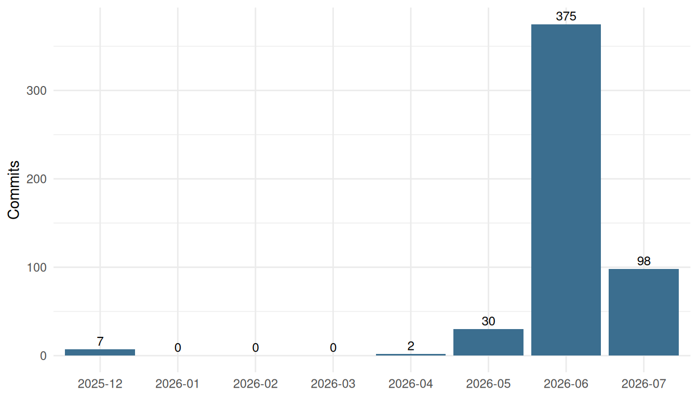
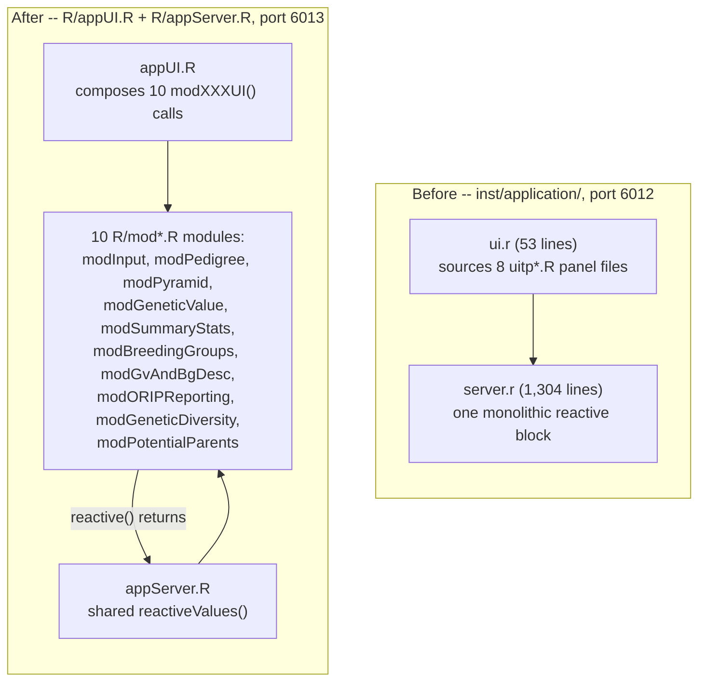
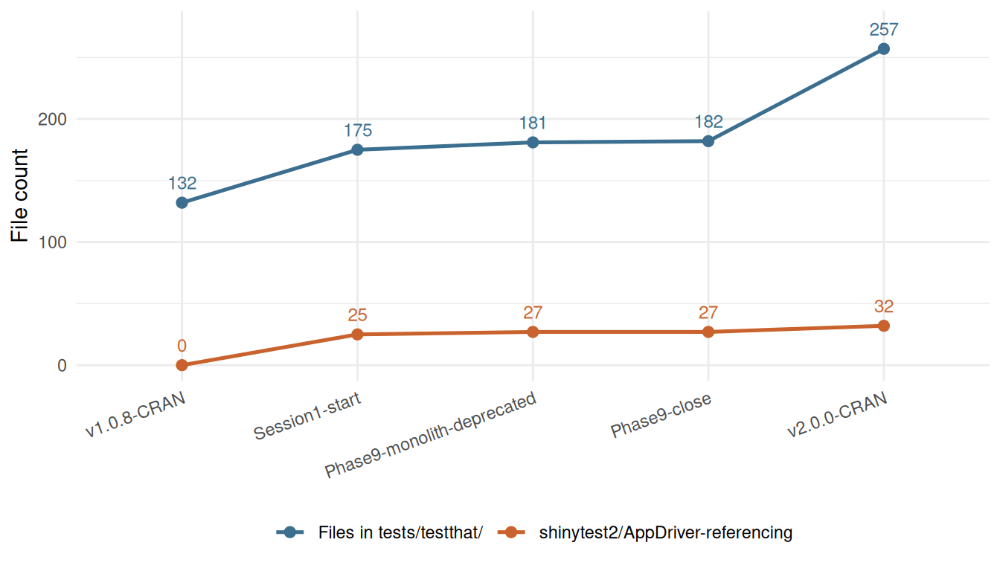
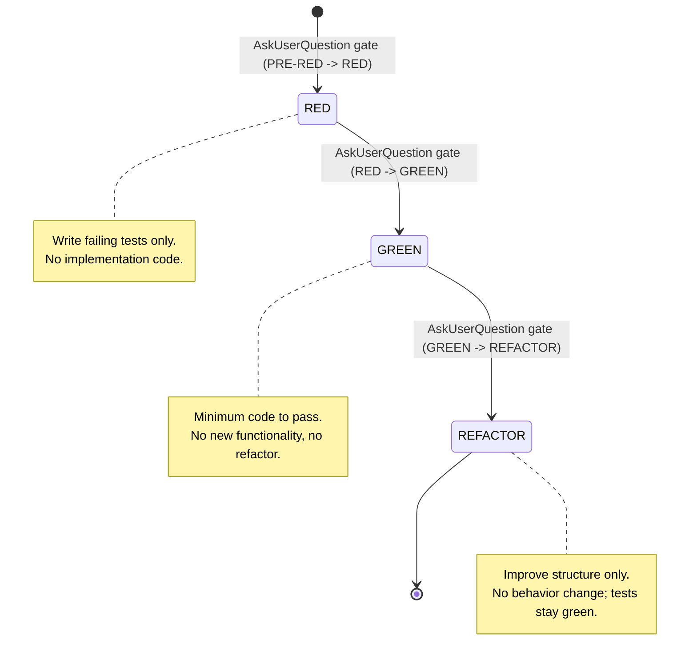
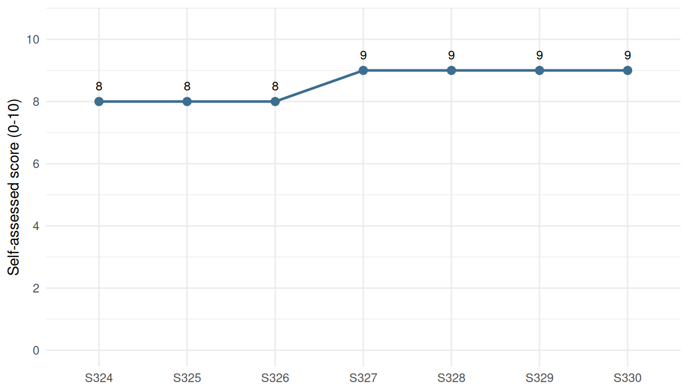

# Engineering nprcgenekeepr 2.0.0: Modular Architecture, Expanded Capability, and an AI-Assisted Development Process

## Section 1 – From Monolith to Modules: the Shiny Architecture Transformation

For most of its life, `nprcgenekeepr` shipped **two coexisting Shiny
applications** that implemented the same features twice. The original,
`inst/application/` – a single `server.r` (1,304 lines) plus a short
`ui.r` (53 lines) that sourced eight separate `uitp*.R` panel files –
ran alongside a newer, module-based rewrite (`R/appUI.R`,
`R/appServer.R`, and a growing set of `R/mod*.R` files). The two had
already begun to drift: different tab identifiers, different default
parameters, a bug fixed in one but not the other. Maintaining both was
tracked as this project’s single biggest source of friction for adding
new features (issue \#27).

“Completing the conversion” meant bringing the modular app to full
feature parity with the monolith, validating it end to end, and then
retiring the monolith outright – not a gradual coexistence, a hard
cutover. That work ran as a **nine-phase, vertical-slice migration** –
each phase one TDD session (RED -\> GREEN -\> REFACTOR with phase
gates), each phase leaving a working application behind it – from
Session 22 to Session 35 (2026-06-03 to 2026-06-06).

Figure 1: Commits per month across the full v1.0.8 -\> v2.0.0 range
(`4548aa1b`..`8ca8bb24`, 512 non-merge commits, as of 2026-07-09). The
June 2026 spike overlaps the nine-phase modularization migration
(Session 22-35, 2026-06-03 to 2026-06-06), but June also carried other,
unrelated work – this chart is overall project pace, not a count of
module-migration commits alone.

[Figure 1](#fig-commit-pace) situates the migration inside the wider
effort: the project moved from occasional, pre-methodology commits in
late 2025 to a sustained pace once the SESSION_RUNNER methodology took
hold in Session 1 (2026-05-30), peaking in June 2026 – the same month
the module migration ran – before settling into a
testing-and-release-hardening pace in July.

### Architecture, before and after

[Figure 2](#fig-architecture) contrasts the two designs directly. The
monolith’s `server.r` was a single large reactive block reading and
writing shared state through ordinary R variables in one scope. The
modular app instead composes independent `modXServer()` functions, each
returning a named list of `reactive()` closures;
[`appServer()`](https://github.com/rmsharp/nprcgenekeepr/reference/appServer.md)
wires those returns into one `shared <- reactiveValues(...)` object and
passes `reactive(shared$...)` down to the modules that need it – an
explicit, if still informal, module contract (documented as XARCH-2 in
the migration plan).

Figure 2: The legacy monolith (`inst/application/`, deleted at Phase 9,
commit `3db018d1`) versus the modular app now launched by
[`runGeneKeepR()`](https://github.com/rmsharp/nprcgenekeepr/reference/runGeneKeepR.md)
(default port 6013, as of 2026-07-09).
[`runModularApp()`](https://github.com/rmsharp/nprcgenekeepr/reference/runModularApp.md)
– the modular app’s original launcher – is now a soft-deprecated alias
that calls
[`runGeneKeepR()`](https://github.com/rmsharp/nprcgenekeepr/reference/runGeneKeepR.md),
so pre-existing callers keep working.

The cutover was declared in Phase 9 (Session 35):
[`runGeneKeepR()`](https://github.com/rmsharp/nprcgenekeepr/reference/runGeneKeepR.md)
became the canonical launcher via
[`lifecycle::deprecate_soft()`](https://lifecycle.r-lib.org/reference/deprecate_soft.html)-aliasing,
and `inst/application/` – 17 files, including `server.r`, `ui.r`, and
the eight `uitp*.R` panels – was deleted in that same, standalone commit
(`3db018d1`, with the alias and orphan cleanup following in
`24992e0b`/`53a9e5e0`/`a1618c48`). Because deletion was its own commit
rather than folded into a parity change, reverting the cutover – had the
modular app proven insufficient – would have been a single `git revert`,
not an unpicking of nine phases of work. As of 2026-07-09, that revert
was never needed.

### The modules today

|  | Module | Responsibility | Lines of code | Test files |
|:---|:---|:---|---:|---:|
| 10 | modSummaryStats | Summary Statistics | 921 | 7 |
| 5 | modInput | Data Input and Quality Control | 716 | 5 |
| 1 | modBreedingGroups | Breeding Groups | 524 | 4 |
| 3 | modGeneticValue | Genetic Value Analysis | 523 | 3 |
| 7 | modPedigree | Pedigree Browser | 401 | 3 |
| 8 | modPotentialParents | Potential Parents | 344 | 3 |
| 6 | modORIPReporting | ORIP Reporting | 325 | 2 |
| 9 | modPyramid | Age-Sex Pyramid | 160 | 2 |
| 2 | modGeneticDiversity | Genetic Diversity | 140 | 1 |
| 4 | modGvAndBgDesc | Genetic Value and Breeding Group Description | 56 | 1 |

Table 1: The ten Shiny modules mounted in the modular app, as of
2026-07-09 (`4,731` total lines across `R/mod*.R`, `R/appUI.R`, and
`R/appServer.R`).

[Table 1](#tbl-modules) lists all ten `R/mod*.R` files that exist in the
package as of 2026-07-09; together with `R/appUI.R` and `R/appServer.R`
they total 4,731 lines. Six of the ten – `modInput`, `modPedigree`,
`modPyramid`, `modGeneticValue`, `modSummaryStats`, and
`modBreedingGroups` – came out of the nine-phase migration itself.
`modGvAndBgDesc` was mounted early in that migration (Phase 2, Session
23). `modORIPReporting` exists and is wired into both
[`appUI()`](https://github.com/rmsharp/nprcgenekeepr/reference/appUI.md)
and
[`appServer()`](https://github.com/rmsharp/nprcgenekeepr/reference/appServer.md),
but only mounts at runtime for an ONPRC site configuration
([`shouldShowOripTab()`](https://github.com/rmsharp/nprcgenekeepr/reference/shouldShowOripTab.md)),
matching the migration plan’s explicit decision to keep it
unwired-but-undeleted rather than build out its functionality.
`modGeneticDiversity` and `modPotentialParents` are **not** migration
artifacts – they were added afterward, as new capabilities in their own
right; Section 2 (new features) covers them.

### The nine-phase migration

| Phase | What shipped | Risk | Session(s) | Commit sha | Status |
|:--:|:---|:--:|:--:|:---|:---|
| 1 | Founder table added to the Summary Stats tab; kinship download moved to the module-internal getKinshipMatrix(); dual-name z-score lookup fix. | LOW-MEDIUM | 22 | 596f6bc9 | DONE |
| 2 | Mounted the GvAndBgDesc description tab; resolved an HTML-id collision with the Genetic Value tab. | LOW | 23 | ef6a9f4c | DONE |
| 3 | Re-exposed the genome-uniqueness threshold selector (default 4); added a subset/filter export. | MEDIUM | 24 | not quoted in source plan | DONE |
| 4 | Genotype-file merge restored for both separate- and common-pedigree input modes. | MEDIUM | 25 | not quoted in source plan | DONE |
| 5 | Breeding Groups: per-group downloads, a per-group kinship view, and a group selector (new "Group Detail" tab). | MEDIUM | 26 | not quoted in source plan | DONE |
| 6 | Breeding Groups: seed-group pre-seeding; exposed three previously inert controls; corrected a 100x default-iteration drift (1000 -\> 10). | MEDIUM | 27 | not quoted in source plan | DONE |
| 7 | Focal-animal / LabKey pedigree build restored (live-EHR path; verification was environmentally limited to a mocked seam). | HIGH | 29 | not quoted in source plan | DONE |
| 8 | shinytest2 E2E harness enabled end-to-end -- expanded into a 4-session subplan (8a-8d, issue \#39) plus a 7-part hardening pass (8e-1..8e-7, issue \#40, Session 37-50). | HIGH | 31-34 (8a-8d) + 37-50 (8e-1..8e-7) | not quoted in source plan | DONE (expanded into 4-session subplan 8a-8d, issue \#39 CLOSED S34; further hardened 8e-1..8e-7, issue \#40, S37-S50) |
| 9 | Declared the modular app canonical: runGeneKeepR() now launches it directly; inst/application/ (17 files) deleted; runModularApp() became the soft-deprecated alias. | HIGH (irreversible) | 35 | 3db018d1/24992e0b/53a9e5e0/a1618c48 | DONE |

Table 2: The nine-phase, vertical-slice migration from monolith to
modular app, Session 22 to Session 35 (2026-06-03 to 2026-06-06).

[Table 2](#tbl-phases) summarizes all nine phases. Phases 1, 2, and 9
are anchored to directly-verified commit shas; phases 3 through 7 are
verified only by their `CHANGELOG.md` session-close-out entries – the
source migration plan does not quote a sha for those phases, and this
article does not invent one. Phase 8 deserves a specific correction
against an earlier, looser characterization of this migration (“phases
1-9 all marked DONE”): it was not a single-session parity phase like its
neighbors. It expanded into its own four-session subplan (8a-8d, Session
31-34, issue \#39, closed at Session 34) and, after that, a further
seven-part hardening pass (8e-1 through 8e-7, Session 37-50, issue \#40)
– documented in the subplan’s own body text and in `CHANGELOG.md`, not
visible from the migration plan’s phase header alone. Phase 9, by
contrast, was the irreversible step: declaring the modular app canonical
and deleting the monolith outright, which is why it carries a HIGH risk
rating even though it shipped in a single session.

## Section 2 – New Capabilities in 2.0.0

Between the v1.0.8 and v2.0.0 CRAN submissions, 47 GitHub issues closed
inside the 512-commit range (2025-07-26 to 2026-07-09). Most of those
closes were not new capability: fixes to existing behavior,
issue-hygiene closes verifying functionality that already existed before
the range (issue \#34, for example, found
[`qcStudbook()`](https://github.com/rmsharp/nprcgenekeepr/reference/qcStudbook.md)
already integrated into `modInput` from pre-migration work and simply
closed the paper trail years later, with no code change), and internal
process items (lint configuration, roxygen documentation harmonization,
`codecov` config consolidation) that belong to no reader-facing section
of this article. [Table 3](#tbl-features) curates the 13 of 47 (28%)
that shipped a capability an analyst or maintainer can actually use – a
genuinely new statistic, a new Shiny tab, or a materially different
default – each traced to its closing issue number and the session(s)
that implemented it.

| Capability | Issue | Session(s) | What it does |
|:---|:---|:--:|:---|
| Descendant-inclusive pedigree filtering | \#35 | 68-69 | The Pedigree Browser's \trim to focal animals\\ option now includes descendants as well as ancestors |
| Configurable auto-generated unknown-ID format | \#44 (umbrella of \#26/#32/#38) | 70-72 | Single source-of-truth \`getAutoIdFormat()\`/\`setAutoIdFormat()\` (default \U%04d\\ byte-identical unconfigured) replaces 8 literal \U\\prefix checks |
| Gestation-derived parent-candidate window | \#31 (umbrella \#45) | 74 | \`getPotentialParents()\`'s dam-exclusion window is derived from each species' actual gestation length instead of a fixed heuristic |
| Potential Parents Shiny tab | \#48 (umbrella \#45) | 80-81 | New \`modPotentialParents\` module surfaces \`getPotentialParents()\` in the app: a sortable candidate-parent table with CSV download |
| ORIP grant-reporting tab wired in and ONPRC-gated | \#47 / \#49 | 83-84 | The pre-existing but never-mounted modORIPReporting module (site info, colony summary, genetic-diversity metrics, CSV downloads) is mounted, gated to ONPRC |
| Species as a first-class pedigree attribute | \#46 | 165-169 | A \`species\` column now drives species-keyed gestation windows and UI defaults, replacing a rhesus-only hardcoded scalar |
| Mean-kinship correction for animals with an unknown parent | \#9 (3 slices) | 176-181 | Genetic Value Analysis classifies each animal's parentage and corrects mean kinship / demotes both-unknown founders in the displayed rank |
| Species-configurable reproductive-parameter table + user overrides | \#73 (Parts 1-2) | 182-189 | A 14-species minimum-breeding-age/gestation table backs Genetic Value Analysis and Potential Parents defaults, with per-session user overrides |
| Genome-uniqueness de-inflation for unknown-origin founders | \#76 | 191-192 | Genome uniqueness (gu) reports 0, not an inflated score, for both-unknown-parentage \Undetermined\\ founders |
| Founder genome equivalents reported with sampling uncertainty | \#82 | 208-209 | \`reportGV()\` gains an \`fgSE\` column alongside \`fg\`, quantifying the estimate's sampling uncertainty |
| Genetic Diversity stoplight-heatmap dashboard | \#112 (4 slices) | 280-283 | New \`modGeneticDiversity\` Shiny tab renders a group x metric red/yellow/green heatmap (proportion-low, origin, production, inbreeding-risk) |
| Species-specific minimum breeding ages, end to end | \#119 (5 slices) | 303-307 | Replaces a single flat minParentAge=2 default with sex- and species-specific minSireAge/minDamAge floors across QC, matching, and the Shiny UI |
| Effective population size (Ne) estimates | \#118 (4 slices) | 310-313 | New exports (gene diversity, sex-ratio Ne, variance Ne) surface a colony's effective, not just census, population size |

Table 3: Curated new capabilities shipped in the v1.0.8 -\> v2.0.0
range: 13 of 47 closed GitHub issues judged genuinely feature-shaped, as
of 2026-07-09.

[Table 3](#tbl-features) groups into three loose clusters, covered
below: parent identification, Genetic Value Analysis uncertainty, and
two new Shiny dashboards.

### Parent identification grows principled and species-aware

The single largest cluster of new capability – five of the thirteen
curated features – reworked how the package identifies and reasons about
parents. It started narrowly: issue \#31 replaced a fixed dam-exclusion
heuristic in
[`getPotentialParents()`](https://github.com/rmsharp/nprcgenekeepr/reference/getPotentialParents.md)
with a window derived from each species’ actual gestation length
(Session 74, commit `0eeee3f6`), and the **Potential Parents** Shiny tab
(issue \#48, Session 80-81) turned that package-level logic into an app
feature for the first time – previously,
[`getPotentialParents()`](https://github.com/rmsharp/nprcgenekeepr/reference/getPotentialParents.md)
had no UI at all.

That work exposed a bigger gap: the package had no first-class notion of
species. Issue \#46 (Session 165-169) added a `species` pedigree column
and made the gestation window and its UI defaults species-keyed instead
of assuming rhesus macaque throughout. Issue \#73 (Session 182-189) went
further, adding a 14-species reproductive-parameter table (minimum
breeding ages, gestation length) with user-configurable overrides,
feeding both Genetic Value Analysis and the Potential Parents tab. Issue
\#119 (Session 303-307, five slices) closed the loop: a single flat
`minParentAge = 2` default – inconsistent with the species-aware
breeding-age table introduced for \#73 – was replaced end to end with
sex- and species-specific `minSireAge`/`minDamAge` floors across QC,
candidate-matching, and the Shiny UI.

### Genetic Value Analysis becomes more honest about uncertainty

Four features changed what Genetic Value Analysis reports, not by adding
a new tab but by making existing statistics more accurate or more
explicit about their own limits. Issue \#9 (Session 176-181, three
slices) stopped animals with an unknown parent from silently inflating
their own mean kinship and falsely top-ranking as “unique” founders –
their parentage is now classified and the displayed rank corrected
accordingly. Issue \#76 (Session 191-192), filed as a direct follow-on
to \#9, carried the same logic to genome uniqueness: a
both-unknown-parentage “Undetermined” founder now reports `gu = 0`
instead of a number with no real biological signal behind it. Issue \#82
(Session 208-209) added a `fgSE` column next to `fg` in
[`reportGV()`](https://github.com/rmsharp/nprcgenekeepr/reference/reportGV.md)’s
output, so the founder genome equivalents estimate ships with its own
sampling uncertainty rather than a bare point value. Issue \#118
(Session 310-313, four slices) added the largest single statistic of the
range: effective population size (Ne) estimates, computed three ways
(gene diversity, demographic sex-ratio, and variance effective size) – a
colony-level number distinct from, and generally smaller than, simple
census count.

### Two new dashboards, and a long-dormant module unlocked

The remaining features are new Shiny surfaces. Issue \#112 (Session
280-283, four slices) added the **Genetic Diversity** tab: a
`modGeneticDiversity` module rendering a group x metric red/yellow/green
heatmap that combines four independent signals (proportion of low
genetic value, Indian-origin status, production status, and inbreeding
risk) into one at-a-glance view per breeding group. Issues \#47 and \#49
(Session 83-84) mounted `modORIPReporting` – a module that had existed,
complete but never wired into the app, since the original Shiny-module
migration ([Section 1](#sec-modules)) – as an ONPRC-only grant-reporting
tab, gated by
[`shouldShowOripTab()`](https://github.com/rmsharp/nprcgenekeepr/reference/shouldShowOripTab.md)
so it does not appear for other sites. Together with the Potential
Parents tab above, three of the ten modules listed in
[Table 1](#tbl-modules) trace their existence, or their activation, to
this section’s work rather than to the migration itself.

Two smaller fixes round out the curated set ([Table 3](#tbl-features)):
issue \#35 (Session 68-69) extended the Pedigree Browser’s focal-animal
trim to include descendants, not just ancestors; and issue \#44 (Session
70-72) replaced eight scattered literal `"U"`-prefix checks with a
single configurable auto-generated-ID format, defaulting to the prior
behavior unconfigured.

## Section 3 – Testing at Scale

Growth in features ([Section 2](#sec-features)) is only as trustworthy
as the tests behind it. Across the same v1.0.8 -\> v2.0.0 range, the
test suite grew from 132 to 257 `.R` files under `tests/testthat/` –
test files plus the shared helpers, fixtures, and setup script that
support them – a 95% increase against a 512-commit range that itself
roughly doubled the package’s feature surface. More consequential than
the raw count, though, is what changed in *kind*: a substantial
browser-driven, end-to-end test harness went from present-but-inert to
executable, and then from executable-but-shallow to exercising real
data-bearing workflows.

| Checkpoint | Date | Commit | Files in tests/testthat/ | shinytest2/AppDriver-referencing |
|:---|:--:|:---|---:|---:|
| v1.0.8-CRAN | 2025-07-25 | 4548aa1b | 132 | 0 |
| Session1-start | 2026-05-30 | 6fd87749 | 175 | 25 |
| Phase9-monolith-deprecated | 2026-06-06 | 3db018d1 | 181 | 27 |
| Phase9-close | 2026-06-06 | a1618c48 | 182 | 27 |
| v2.0.0-CRAN | 2026-07-09 | 8ca8bb24 | 257 | 32 |

Table 4: Test-suite growth at five checkpoints across the v1.0.8 -\>
v2.0.0 range, as of 2026-07-09. “Files in tests/testthat/” counts every
`.R` file in the directory (test files plus helpers/fixtures/setup);
“shinytest2/AppDriver-referencing” is the subset that names the
browser-testing package or its driver class.

Figure 3: Test-suite growth over the same five checkpoints as
[Table 4](#tbl-testing-growth). The shinytest2/AppDriver-referencing
count is near-zero relative to the total and is plotted against the same
axis for comparison, not because it is negligible – see prose for what
that subset represents.

[Table 4](#tbl-testing-growth) and [Figure 3](#fig-testing-growth)
ground the growth claim in five checkpoints rather than just the two
endpoints: the v1.0.8 CRAN submission (`4548aa1b`, 2025-07-25, before
this project adopted the SESSION_RUNNER methodology), the start of
Session 1 (`6fd87749`, 2026-05-30), the two commits bracketing Phase 9
of the module migration ([Section 1](#sec-modules)), and the v2.0.0 CRAN
submission (`8ca8bb24`, 2026-07-09). The
shinytest2/AppDriver-referencing count is already 25 files at Session
1’s start – that scaffold predates this project’s methodology entirely;
it was built on the module branch (commit `7da01afe`) during the same
pre-Session-1 work that produced the modular app itself, but, as the
next section describes, it did not run.

### From a dormant scaffold to an executable, hardened harness

A shinytest2 browser end-to-end suite existed in the tree from early in
the module migration, but it did not work: the driver helper functions
its 23 test files called – `create_app_driver()`, `navigate_to_tab()`,
`get_html_safe()`, and four others – were never defined. Every call
would have thrown “could not find function” if the suite had run;
instead, an opt-in gate added at Session 19 (`create_test_app()`) made
it skip cleanly by default, so the gap was invisible rather than failing
loudly. Issue \#39 tracked closing it.

A Session 30 planning pass found the gap was larger than the parent
migration plan’s Phase 8 had assumed – 6 undefined helpers plus one
undefined constant, not the 3 the plan named – and decomposed the work
into a four-session sub-plan
(`docs/planning/phase8-e2e-harness-subplan.md`, sub-phases 8a-8d,
Session 31-34). 8a defined the helpers browser-free; 8b proved Chrome
and the modular app itself would boot under `shinytest2`, the first-ever
browser run, and rewired CI to run the suite on a nightly schedule plus
manual dispatch rather than per pull request (browser tests are slower
and more flake-prone than the existing fast unit CI, which remained the
per-PR gate); 8c and 8d brought the remaining 20 files to
green-or-clean-skip. Issue \#39 closed at the end of Session 34
(2026-06-06) on the sub-plan’s own explicit completion bar: **executable
and CI-green opt-in**, not behavioral validation.

That bar was deliberate, not an oversight. The sub-plan documented, in
the same session that closed \#39, why an executable suite does not by
itself mean the suite validates behavior: `navbarPage` renders every
tab’s static markup into the DOM at boot, hidden by CSS, so the suite’s
dominant pattern – navigate to a tab, then
[`grepl()`](https://rdrr.io/r/base/grep.html) a keyword against the
whole page body – passes once the app merely boots, regardless of which
tab is actually selected. Coverage at the end of 8d was boot-level. A
follow-on issue, \#40, was filed at that same session to close that
specific gap.

Closing \#40 took a further seven-slice pass (8e-1 through 8e-7, Session
37-50, 2026-06-07 to 2026-06-10) that replaced boot-level
`expect_true(TRUE)` tautologies – 41 of them, suite-wide – with
assertions tied to the actually-selected pane, fixed a wrong-tab
navigation defect in the Summary Statistics family (7 of 8 tests
targeted “Genetic Value Analysis” instead of their own tab), and, in its
last three slices (8e-6a/b/c), rewired the pedigree-upload, Genetic
Value Analysis, and breeding-group E2E blocks to drive the package’s
real analytical pipelines end to end rather than asserting against
static markup. A final slice, 8e-7 (Session 50), addressed an
operational flake rather than a behavioral gap: running all 23 files in
one CI process had produced roughly one transient Chrome/driver error
per five full-tier runs; partitioning the run into 13 per-module groups,
each a fresh R process, capped any single process at three files. Issue
\#40 closed the following day, 2026-06-11.

As of 2026-07-09, both issues are closed and the harness the sub-plan
describes is the one currently checked in:
`.github/workflows/shinytest2.yaml` runs nightly (07:00 UTC) and on
manual dispatch, opts every test in via `NPRC_RUN_E2E`, and executes the
23-file `^(app|e2e)-` tier as the 13-group partition 8e-7 added –
distinct from `R-CMD-check.yaml` and `test-coverage.yaml`, which remain
the fast, per-pull-request gate.

## Section 4 – An AI-Assisted Development Process

Sections 1 through 3 describe *what* changed between v1.0.8 and v2.0.0.
This section describes *how*: every session in that work was directed by
**Claude Code** (Claude CLI) operating under a written protocol –
`SESSION_RUNNER.md`, `SAFEGUARDS.md`, and this package’s own `CLAUDE.md`
– rather than open-ended prompting. Within the same 512-commit range as
Sections 1-3, **328 numbered sessions** (Session 1, `6fd87749`,
2026-05-30, through Session 328, the exact v2.0.0-submission commit
itself, `8ca8bb24`) account for 502 of those commits; the other 10
predate the methodology – informal module-branch experimentation plus
the framework’s own bootstrap commit (`299060c0`, 2026-04-02).

| Metric                                                 | Count |
|:-------------------------------------------------------|------:|
| Sessions in range (Session 1 -\> Session 328)          |   328 |
| Pre-methodology commits in range                       |    10 |
| Session-1-to-range-end commits                         |   502 |
| Total commits in range                                 |   512 |
| CHANGELOG.md ledger entries                            |   309 |
| PROJECT_LEARNINGS.md entries                           |   305 |
| Complete HANDOFFS.md receipts                          |     7 |
| Self-assessments reporting 0 stakeholder corrections   |   269 |
| Self-assessments reporting \>=1 stakeholder correction |     2 |

Table 5: Engineering-process metrics, as extracted at the Phase A data
freeze (Session 331, 2026-07-09). `CHANGELOG.md`,
`PROJECT_LEARNINGS.md`, `HANDOFFS.md`, and `SESSION_NOTES.md` are live,
append-only files that kept growing in every session after this
extraction ran – including the four sessions (331-334) that drafted the
rest of this article – so these counts are a snapshot, not this
article’s own present state.

### A written protocol, not open-ended prompting

Each session follows the same three-phase shape. **Orient** reads
`SAFEGUARDS.md` and `SESSION_NOTES.md`, checks open GitHub issues, runs
a project health dashboard (`methodology_dashboard.py`), and reconciles
`CHANGELOG.md`/`HANDOFFS.md` against `git log` for any commit a prior
session left unrecorded – then reports what it found and stops for
direction; no work begins before the owner responds. **Execute** commits
to exactly **one deliverable** per session (“1 and done”) and claims it
in `SESSION_NOTES.md`/`HANDOFFS.md` before any technical work starts, so
a session that crashes mid-task still leaves a trace. **Close out**
evaluates the previous session’s handoff, self-assesses against a
written score, records new learnings, writes the next session’s handoff,
and appends a dated entry to `CHANGELOG.md` before committing.
`SESSION_RUNNER.md` names the failure to do that last step **“unrecorded
action”** – one of 27 named, numbered failure modes the protocol
maintains, each added after a session was observed failing that specific
way.

### Strict TDD, gated by explicit confirmation

For production R code – not this article’s own drafting sessions, see
below – `CLAUDE.md`’s Development Process Contract requires **strict
red-green-refactor TDD**: RED writes only failing tests, no
implementation code; GREEN writes the minimum implementation that passes
them, no new functionality; REFACTOR improves structure with no behavior
change, all tests still passing. [Figure 4](#fig-tdd-cycle) diagrams the
cycle. What makes it more than a style guideline is the enforcement
mechanism: the assistant must declare its current phase at the top of
every response, and every phase transition (`PRE-RED->RED`,
`RED->GREEN`, `GREEN->REFACTOR`) is gated by a structured
`AskUserQuestion` prompt – not a prose question – with a header of the
exact form `TDD: <FROM>-><TO>`, an option spelling out the concrete
next-phase actions and verification, and an explicit hold/alternative
option. Skipping a phase, or writing implementation code during RED, is
a declared protocol violation the assistant must acknowledge and
correct.

Figure 4: The RED -\> GREEN -\> REFACTOR cycle `CLAUDE.md`’s Development
Process Contract requires for production R code, with an explicit
`AskUserQuestion` confirmation gate at every transition. Documentation
and article-drafting sessions – including all four sessions that
produced Sections 1-3 and the session that produced this one – are an
explicitly declared exception (TDD phase “N/A”, stated at the top of
every response) rather than a silent omission.

This article’s own drafting sessions illustrate the exception rather
than the rule: none touched `R/` or `tests/`, so each declared **TDD
phase: N/A** explicitly in every response instead of running the cycle
against prose it does not apply to – a small instance of the same
discipline extending to correctly scoping *when* a rule applies, not
applying it uniformly regardless of fit.

### Self-assessment and a durable correction ledger

[Figure 5](#fig-self-score-trend) plots every complete `HANDOFFS.md`
self-assessment score against session, for the sessions with one
available.

Figure 5: Session self-assessed scores (0-10 scale, `HANDOFFS.md`’s
`self_score` field), the 7 sessions with a complete receipt as of the
Phase A data freeze. **Partial window, not a trend across the range:**
receipts began at Session 324, one session before the `CHANGELOG.md`
ledger-format resolution (Session 325) – these 7 sessions are roughly 2%
of the 328-session range, and Sessions 329-330 were committed after the
range’s own end commit (`8ca8bb24`), on the same calendar day. Mean
score across the 7: 8.57.

The mechanism behind that self-scoring is a durable receipt, not a
spoken summary: each session writes a `HANDOFFS.md` block recording what
it did, what is next, key files, gotchas, and its own score, and the
*next* session scores that handoff in turn before starting its own work
– visible in [Table 5](#tbl-process-metrics) as 7 complete receipts
against 328 sessions in range (the receipt requirement itself dates to
Session 324). The same append-only discipline extends to `CHANGELOG.md`,
and this article’s own drafting sessions are a live, verifiable example
of it working: each of the four sessions that wrote Sections 1-3 closed
out with a `commit: pending` placeholder in its own `HANDOFFS.md`
receipt (a session cannot know its own close-out commit’s sha before
making that commit), corrected the placeholder with one small follow-up
commit once the sha existed, and – because that follow-up commit landed
after the session’s own `CHANGELOG.md` entry was already written – the
*following* session’s Orient step caught and logged it in turn:
`cc0f7798` (Session 331’s fix, logged by Session 332), `2278b46f`
(Session 332’s fix, logged by Session 333), `ee690776` (Session 333’s
fix, logged by Session 334), and `5f0b81d2` (Session 334’s fix, logged
by this article’s fifth session). Four consecutive sessions produced the
same small gap; four consecutive Orient steps caught it.

`PROJECT_LEARNINGS.md` – 305 dated entries as of the same Phase A
freeze, each naming a concrete finding, file, mechanism, and verdict,
plus a glossary of named recurring reflexes cited by tag – is this
project’s running record of what went wrong and what fixed it.
`SESSION_RUNNER.md` maintains a parallel, numbered catalog of 27 named
failure modes at the methodology level – among them “Eager to start”
(skipping orientation), “Minimal handoff” (a technically-present but
functionally useless handoff), and “Unrecorded action” (the gap the
receipt-sha backfills above illustrate) – each added after a session was
observed failing that way. Neither catalog is edited to remove an entry
once a session outgrows it; corrections accumulate rather than get
erased.

[Table 5](#tbl-process-metrics)’s stakeholder-correction figures are the
least precise numbers in this section, and are presented with that
caveat rather than smoothed over: across `SESSION_NOTES.md`’s
self-assessments, 269 explicit mentions report zero stakeholder
corrections and 2 report exactly one – 99.3% zero, by mention count.
That is a text-mention proxy, not an independently re-verified
per-session audit; a session’s own self-assessment is not an external
check on itself. Read it as “the sessions that stated a number mostly
stated zero,” not as an audited defect rate.
