```{r}
#| label: setup
#| include: false
knitr::opts_chunk$set(
  collapse = TRUE, comment = "#>",
  echo = FALSE, warning = FALSE, message = FALSE
)
```

## Abstract {#sec-abstract}

`nprcgenekeepr` provides genetic tools for primate-colony management: studbook
quality control, pedigree construction and browsing, age-sex demographic
display, genetic value analysis, and breeding-group formation, delivered
through both a Shiny application (`runGeneKeepR()`) and an exposed R API. This
article is a practical, screenshot-illustrated guide for colony managers and
primate-center bioinformatics staff, complementing the engineering account in
["Engineering nprcgenekeepr 2.0.0"](engineering-the-2.0.0-release.html) and the
six feature-depth articles listed in @sec-approach. Section 1 explains why the
package exists; Section 2 maps its five function groups onto the app's tabs
and onto the two ways to use them (point-and-click or scripted); Section 3
walks a colony manager through the entire application, tab by tab, using the
package's own shipped example pedigree. This article's own preparation
surfaced and fixed three production issues along the way -- an Excel-upload
defect that could silently corrupt sire/dam IDs, a "Custom" breeding-group
sex ratio option with no numeric input, and a shipped example pedigree
missing a column the Potential Parents tab needs to demonstrate populated
results -- each described where it arose rather than glossed over. All
claims in this article are current as of 2026-07-17.

## Introduction {#sec-introduction}

This article is an onboarding guide to `nprcgenekeepr` for the audience it was
built for: primate-center bioinformatics staff and colony managers evaluating
or learning to use the package. It answers three questions in order --
**why** the package exists, **how** its capabilities are organized, and
**what it looks like to actually use it** -- using the Shiny application
(`runGeneKeepR()`) as the walkthrough's frame of reference.

It is one of three documents that together cover the package from different
angles. ["Engineering nprcgenekeepr
2.0.0"](engineering-the-2.0.0-release.html) documents the modular-architecture
migration and development process behind the current application -- read it
for the *how it was built* story. Six shorter feature articles (linked from
@sec-approach's table) each walk one capability in depth, directly through
the R API rather than the Shiny app. This article does neither of those jobs:
it is the practical, tab-by-tab guide to *using* the application as shipped,
aimed at a reader who wants to load a pedigree and get results, not read
source code.

**Scope.** Every claim below describing the current application -- tab list,
control labels, default values, and any number tied to the package's own
`data(examplePedigree)` example data -- was re-verified directly against the
source and a live run of the app, as of 2026-07-17. Nothing here is carried
forward uncritically from earlier tutorials.

## Section 1 -- Purpose: Why nprcgenekeepr Exists {#sec-purpose}

The goal of `nprcgenekeepr` is to implement genetic tools for colony
management. It was initially conceived and developed as a Shiny web
application at the Oregon National Primate Research Center (ONPRC) to
facilitate analyses that center routinely performs, and has since been
enhanced so that its underlying functions can also be used directly in R
scripts rather than only through the Shiny interface (see @sec-approach's
"two ways to use them").

Captive breeding colonies -- rhesus macaques and other nonhuman primates at
National Primate Research Centers -- need to manage genetic diversity across
generations: avoiding the mating of closely related animals, preserving rare
alleles carried by relatively few individuals, and forming breeding groups
that balance those genetic goals against real behavioral and housing
constraints. `nprcgenekeepr`'s ranking and grouping methodology follows Vinson
and Raboin (2015), *A Practical Approach for Designing Breeding Groups to
Maximize Genetic Diversity in a Large Colony of Captive Rhesus Macaques
(Macaca mulatta)*, *Journal of the American Association for Laboratory Animal
Science*, 54(6), 700-707.

This work has been supported in part by NIH grants P51 RR13986 to the
Southwest National Primate Research Center and P51 OD011092 to the Oregon
National Primate Research Center.

## Section 2 -- Approach: The Five Function Groups and Two Ways to Use Them {#sec-approach}

`nprcgenekeepr`'s capability is organized around five function groups. Each
maps onto one or more tabs in the Shiny application (walked in @sec-practice)
and, for readers who want to script rather than click, onto a feature article
that demonstrates the same underlying functions directly through the R API.

| # | Function group | App tab(s) | Read deeper (R-API walkthrough) |
|---|---|---|---|
| 1 | Quality control of studbooks | Input | [Studbook Quality Control](studbook-quality-control.html) |
| 2 | Pedigree construction and browsing, including identifying candidate parents for animals with unknown parentage | Pedigree Browser, Potential Parents | [Building a Focal-Animal Pedigree Offline](offline-focal-animal-workflow.html) |
| 3 | Age-sex demographic display | Age-Sex Pyramid | [Age-Sex Pyramid Plots](age-sex-pyramid.html) |
| 4 | Genetic value analysis (mean kinship, genome uniqueness) | Genetic Value Analysis, Genetic Value Analysis and Breeding Group Description | [Genetic Value Analysis](genetic-value-analysis.html); [Validating the Founder-Genome-Equivalent Standard Error](fg-se-validation.html) |
| 5 | Breeding-group formation and ongoing diversity monitoring | Breeding Groups, Genetic Diversity | [Forming Breeding Groups](breeding-group-formation.html) |

: Function groups, the app tabs that expose them, and the companion articles
that demonstrate them via the R API. {#tbl-function-groups}

The Genetic Diversity and Potential Parents tabs (rows 2 and 5) are recent
additions that extend two of the five original groups rather than
constituting new ones: Potential Parents extends pedigree construction by
proposing candidate parents for animals recorded with unknown parentage;
Genetic Diversity extends breeding-group formation by monitoring the
diversity of groups once they are formed. Both are covered in
@sec-practice alongside the tabs they extend.

These five groups compose into one pipeline, from a raw studbook to formed
breeding groups:

```{mermaid}
flowchart LR
  A["Raw studbook<br/>Excel or CSV"] --> B["Quality Control<br/>(Input tab)"]
  B --> C["Pedigree<br/>(Pedigree Browser tab)"]
  C --> D["Potential Parents<br/>tab"]
  C --> E["Age-Sex Pyramid<br/>tab"]
  C --> F["Genetic Value Analysis<br/>tab"]
  C --> G["Breeding Groups<br/>tab"]
  F --> G
  G --> H["Genetic Diversity<br/>tab"]
  F --> H
```

**Two ways to use it.** Everything in this pipeline is available both through
the Shiny application walked in @sec-practice and as directly callable R
functions -- `NAMESPACE` exports 182 functions as of 2026-07-17. An open
GitHub issue ([#37](https://github.com/rmsharp/nprcgenekeepr/issues/37))
tracks, function by function, which exports the Shiny app itself exercises
versus which exist primarily for scripted or batch workflows; its own most
recent re-verification (2026-06-16) predates the current export count, so
treat its exact split as directional rather than a precise current figure.
The practical takeaway for this article's audience: if a task in
@sec-practice feels like it should be scriptable -- batch-processing several
pedigrees, or running a workflow without a browser -- it very likely already
is; the six feature articles in @tbl-function-groups are worked examples of
exactly that.

## Section 3 -- Practice: A Colony Manager's Walkthrough {#sec-practice}

This section walks every tab of the Shiny application in order, using the
package's own shipped example data (`data(examplePedigree)`,
`data(focalAnimals)`) throughout so every step below is reproducible. Start
the application with:

```{r}
#| label: run-app
#| echo: true
#| eval: false
library(nprcgenekeepr)
runGeneKeepR()
```

(`runModularApp()` also still launches the application but is deprecated in
favor of `runGeneKeepR()`.) The complete online documentation, including the
function reference and this article's companions, is at
<https://rmsharp.github.io/nprcgenekeepr/>.

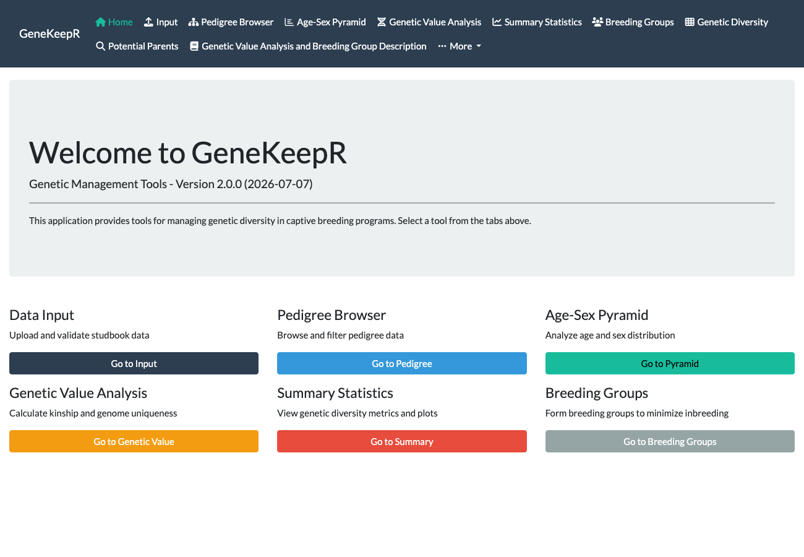{fig-alt="GeneKeepR Home tab showing a welcome panel and six quick-link cards to Input, Pedigree Browser, Age-Sex Pyramid, Genetic Value Analysis, Summary Statistics, and Breeding Groups."}

### Uploading a Pedigree File

The **Input** tab's "Input Format" sub-tab documents the exact file formats
and column requirements accepted -- consult it directly rather than a
description here, since it is kept in sync with the package's actual reader
code and this article is not.

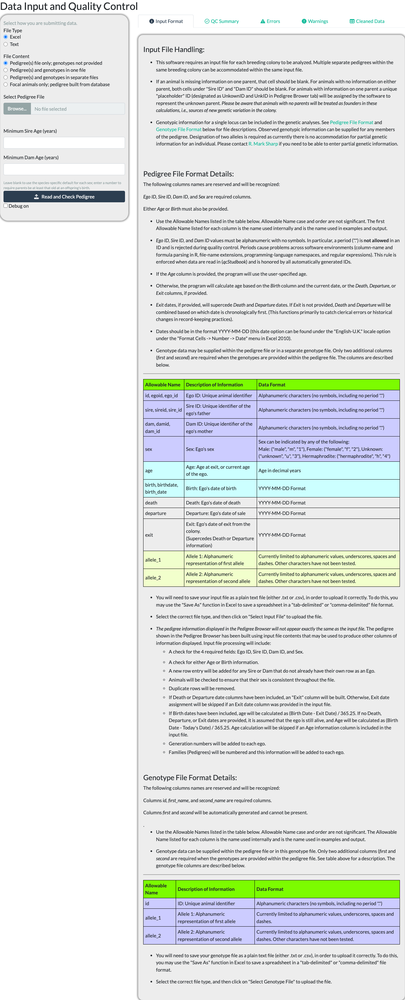{fig-alt="Input tab showing the Input Format documentation sub-tab with file structure guidance."}

Choose a **File Type** (Excel or Text) and a **File Content** option --
pedigree only, pedigree and genotypes together or in separate files, or focal
animals only (built from a database connection or, offline, from a second
uploaded pedigree file) -- then browse for the file itself.

::: {.callout-note}
**Fixed before publication.** An earlier draft of this walkthrough found that
uploading an Excel workbook shaped like the package's own shipped example
pedigree (several placeholder-parent rows before alphanumeric IDs) silently
corrupted the sire/dam columns: `readxl` inferred those columns' type from
the early blank rows, guessed `logical`, and converted every later
alphanumeric ID it could not parse as logical to `NA` -- with no warning
surfaced to the user. This affected the same upload path any Excel-format
pedigree goes through, not just this example file. **Fixed** by routing the
Excel read through the same `col_types = "text"` helper the package's other
Excel readers already use, so both CSV and Excel now round-trip correctly.
This walkthrough continues to use CSV below for simplicity, not to work
around any remaining defect.
:::

{fig-alt="Input tab sidebar showing File Type, File Content, and file-selection controls before a file is chosen."}

```{r}
#| label: make-example-file
#| echo: true
#| eval: false
makeExamplePedigreeFile(fileType = "csv")
```

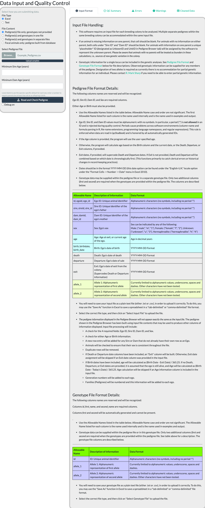{fig-alt="Input tab showing the example pedigree file selected for upload."}

Two optional fields, **Minimum Sire Age** and **Minimum Dam Age**, are each
left blank by default so that a species- and sex-specific breeding-age
default is used automatically; type a number in either field to override that
sex's floor (for macaques, which may reproduce as early as two years of age,
a value of 2 is appropriate for both).

{fig-alt="Input tab showing the Minimum Sire Age and Minimum Dam Age fields both set to 2."}

Selecting **Read and Check Pedigree** reads the file and validates it --
checking that every required column is present and that the pedigree is
internally consistent (parent-of-the-right-sex, no duplicate IDs, valid
dates, and more; the full set of checks is listed below). Results appear on
the "QC Summary" sub-tab. For the shipped example pedigree read as CSV, this
reports **Records Processed: 3,694, Errors: 0, Warnings: 1**.

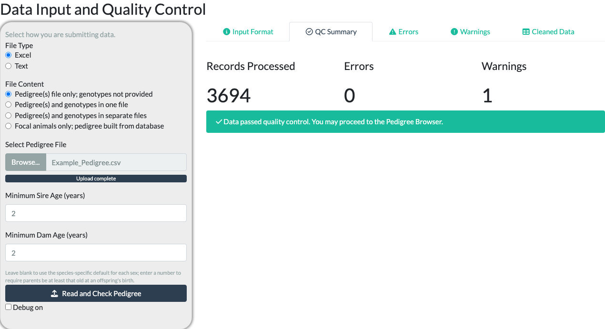{fig-alt="QC Summary sub-tab showing Records Processed 3694, Errors 0, Warnings 1."}

```{r}
#| label: error-defs
#| echo: false
errorTypes <- c(
  "failedDatabaseConnection", "missingColumns", "invalidDateRows",
  "suspiciousParents", "femaleSires", "maleDams", "sireAndDam",
  "duplicateIds", "invalidIdChars", "changedCols"
)
errorDescriptions <- c(
  "Database connection failed: configuration or permissions are invalid.",
  "Columns that must be within the pedigree file are missing.",
  "Values that are supposed to be dates cannot be interpreted as a date.",
  "A parent was too young, on the offspring's birth date, to plausibly be the parent.",
  "Individuals listed as female or hermaphroditic and also as a sire.",
  "Individuals listed as male and also as a dam.",
  "Individuals listed as both a sire and a dam.",
  "IDs listed more than once.",
  "IDs (id, sire, or dam) containing a disallowed period ('.'); IDs must be alphanumeric with no symbols.",
  "Columns renamed to conform to internal naming conventions, and what they were changed to."
)
knitr::kable(
  data.frame(Error = errorTypes, Definition = errorDescriptions),
  caption = "QC error types checked by Read and Check Pedigree."
)
```

### Pedigree Browser

The **Pedigree Browser** tab displays the pedigree in a paged table (10, 25,
50, or 100 rows at a time) with a **Display Unknown IDs** option. Unknown IDs
(UIDs) are placeholder IDs the application generates, by default starting
with the letter U, for the unrecorded parent of an animal with only one
known parent.

{fig-alt="Pedigree Browser table with Display Unknown IDs checked, showing UNKNOWN placeholder IDs."}

Unchecking **Display Unknown IDs** removes those placeholder rows. For the
example pedigree, the row count reduces from **3,694 to 2,322** -- the
difference, 1,372, is the number of UNKNOWN placeholder animals the
application generated to stand in for unrecorded parents.

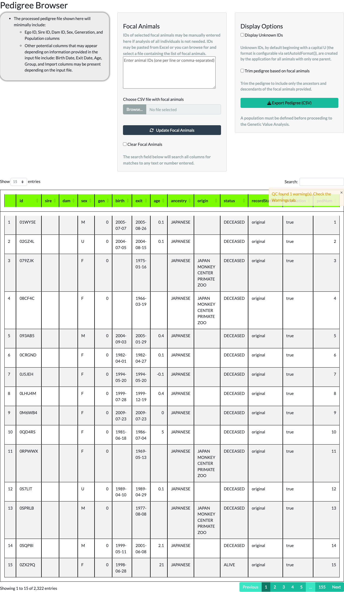{fig-alt="Pedigree Browser table with Display Unknown IDs unchecked, showing 2322 rows."}

**Focal animals.** The middle panel lets you narrow the browser to a subset
of the pedigree -- your *focal animals* -- either by typing IDs directly or
by uploading a CSV file of IDs.

{fig-alt="Pedigree Browser Focal Animals panel with an empty text area for entering animal IDs."}

Typing five IDs (`FJS7RQ, H6T2FF, HEVL3L, I04JZV, S63QDN`), unchecking
**Display Unknown IDs**, checking **Trim pedigree based on focal animals**,
and selecting **Update Focal Animals** keeps only those five animals and
their ancestors and descendants -- **54 animals** in total for this example.

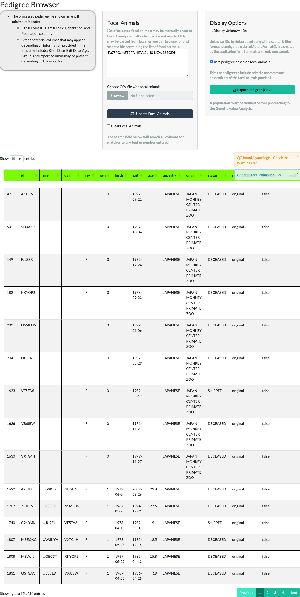{fig-alt="Pedigree Browser table trimmed to 54 animals related to 5 focal animals."}

A larger focal-animal list works the same way. The package ships a second
example object, `data(focalAnimals)`, with 327 IDs; uploading it as a CSV via
**Choose CSV file with focal animals** and trimming keeps those animals plus
everyone needed to connect them -- **962 animals** in total.

{fig-alt="Pedigree Browser showing a larger focal-animal CSV file selected for upload."}

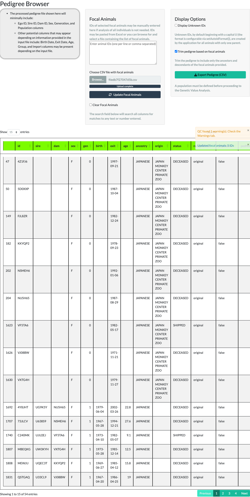{fig-alt="Pedigree Browser with Trim pedigree based on focal animals checked, ready to update."}

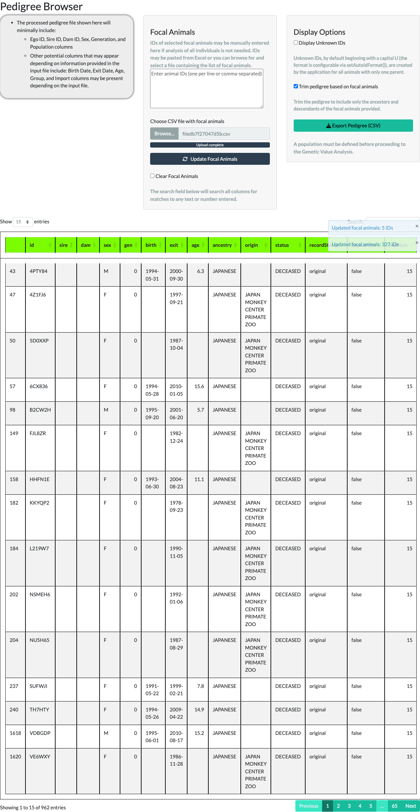{fig-alt="Pedigree Browser table trimmed to 962 animals related to the larger focal-animal list."}

Checking **Clear Focal Animals** and selecting **Update Focal Animals** again
reads an empty ID list, restoring the full, untrimmed pedigree.

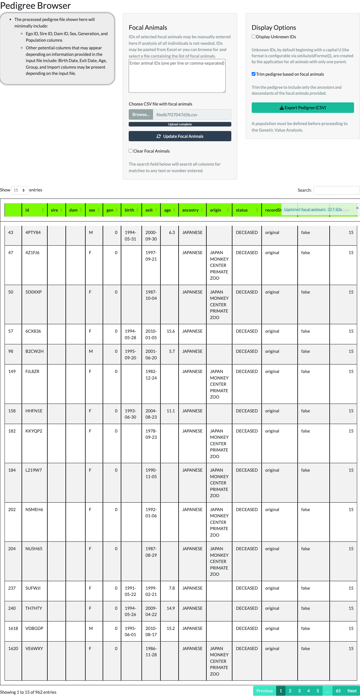{fig-alt="Pedigree Browser before clearing the focal-animal list, still trimmed."}

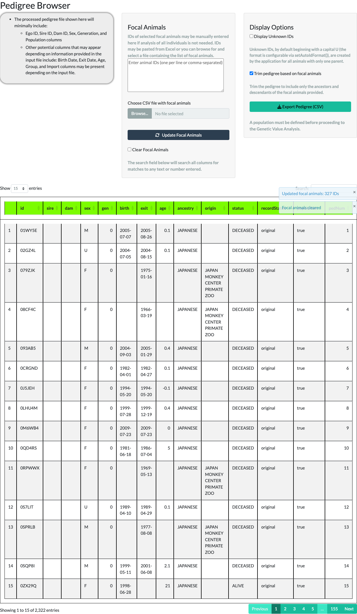{fig-alt="Pedigree Browser after clearing the focal-animal list, showing the full untrimmed pedigree."}

A population must be defined here before proceeding to Genetic Value
Analysis. The rest of this walkthrough continues with the **full, untrimmed**
example pedigree (the focal-animal trim above illustrates the feature, not
the population used for the remaining tabs) -- matching the shipped
`examplePedigree`'s own downstream numbers below.

### Age-Sex Pyramid

The **Age-Sex Pyramid** tab displays a standard population pyramid for
whichever pedigree population is currently selected in Pedigree Browser, with
options for age units, color scheme, and whether to show counts. For the
full example pedigree, it shows **332 living animals** (123 male, 209
female).

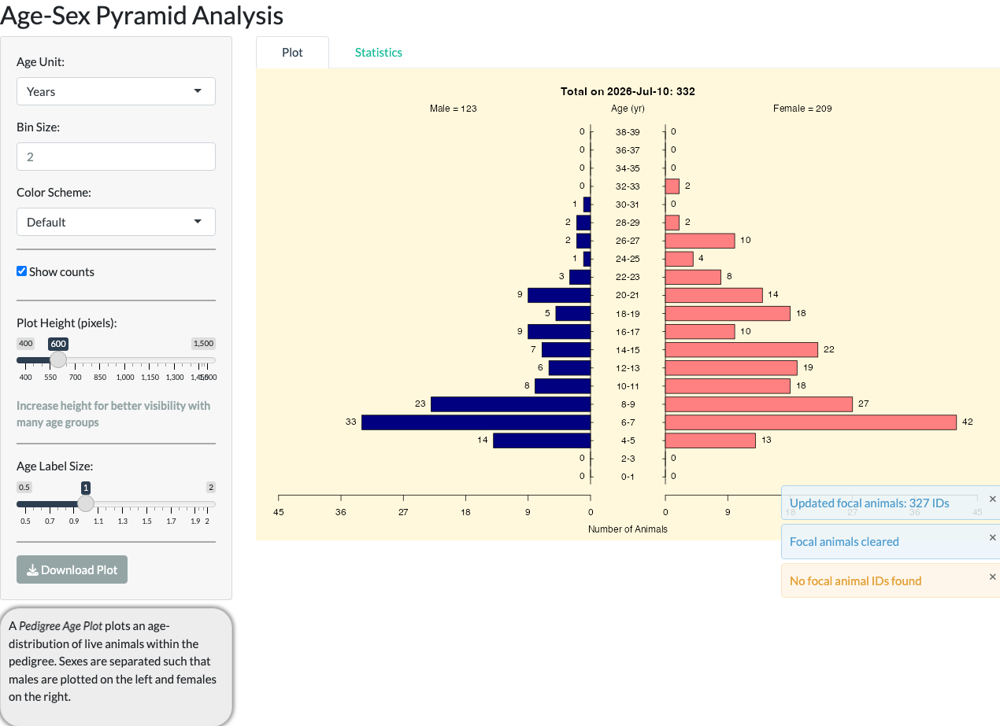{fig-alt="Age-Sex Pyramid plot showing 332 living animals, 123 male and 209 female."}

### Genetic Value Analysis

The **Genetic Value Analysis** tab ranks animals by relative breeding value,
using mean kinship (how inter-related an animal is with the rest of the
current breeding population -- lower is better) and genome uniqueness (how
likely an animal carries alleles that are rare in the colony and at risk of
being lost -- higher is better). See the **Genetic Value Analysis and
Breeding Group Description** tab for the full calculation breakdown.

Genome uniqueness is estimated by a gene-drop simulation (MacCluer et al.
1986; Ballou and Lacy 1995): unique alleles are assigned to every pedigree
founder and simulated forward through the pedigree according to Mendelian
rules. Because it is an estimate, each value carries a sampling standard
error (the `guSE` column) that shrinks roughly with the square root of the
iteration count -- but what actually matters for breeding decisions is
whether the *ranking order* has stabilized, not just whether `guSE` is small.
The default is **1,000 iterations**, which experience with the pedigrees this
package has been used on gives a stable selection order; to check whether
1,000 is enough for a specific pedigree, run `gvaConvergence()` (see the
*Gene-Drop Iteration Convergence* vignette,
`vignette("gvaConvergence", package = "nprcgenekeepr")`).

An optional **Kinship Overrides** panel accepts a CSV or Excel file of
outside-information kinship values (columns `id1`, `id2`, `kinship`) for
specific pairs -- for example, genotype-confirmed relatedness that
disagrees with the pedigree. Overrides apply to rankings, breeding groups,
and summary statistics regardless of tab order, though the Summary
Statistics relationship *label* stays pedigree-derived even when its
displayed value is overridden.

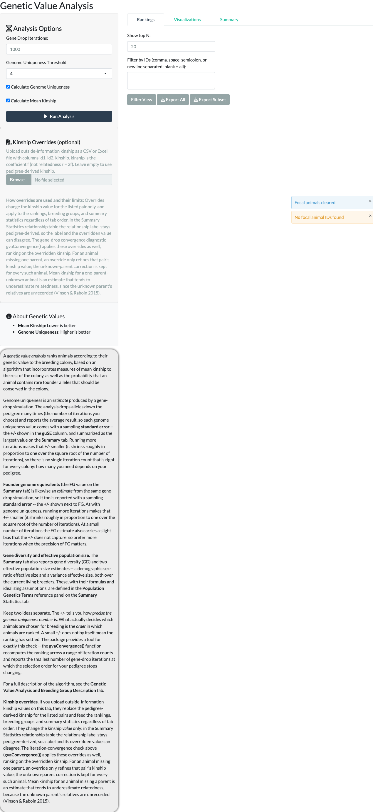{fig-alt="Genetic Value Analysis tab showing analysis options and the optional Kinship Overrides panel, ready to run."}

Selecting **Run Analysis** starts the gene-drop process. When it completes, a
results table shows each animal's rank, mean kinship, genome uniqueness, and
a `value` column classifying it as High Value, Low Value, or Undetermined.
"Show top N" and an ID filter control how many rows are displayed.

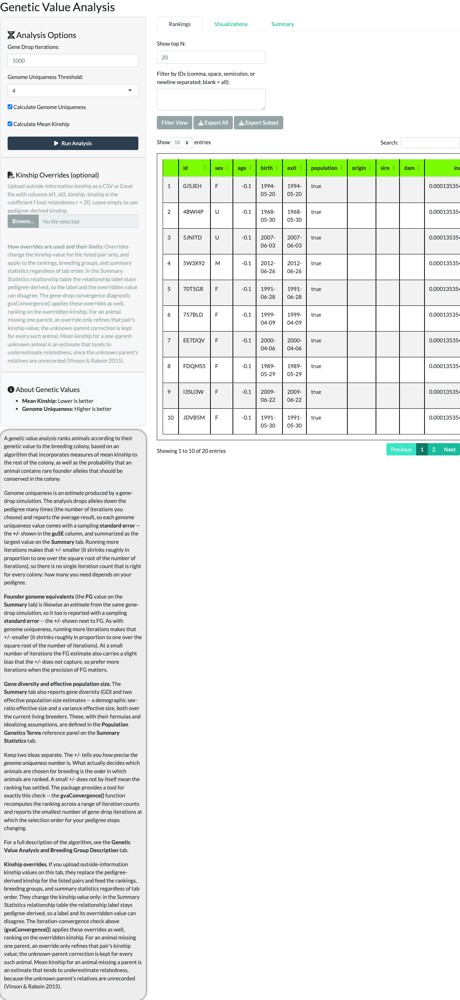{fig-alt="Genetic Value Analysis results table showing the top-ranked animals by genetic value."}

**A correction to an older claim.** Animals with no recorded parentage
("Undetermined" -- typically imports or very young animals not yet assigned
parents) are *not* automatically high value. Since issue #9's ranking
correction (`R/modGeneticValue.R:289-301`), the results table sorts
Undetermined animals to the *bottom* of the ranking, so a genuinely uncertain
genome-uniqueness estimate no longer inflates them to the top. Because the
exact row at which values transition from High to Low is a property of one
stochastic gene-drop run, this article does not pin a specific row number to
it -- widening "Show top N" (to 500 below) shows the full distribution
instead.

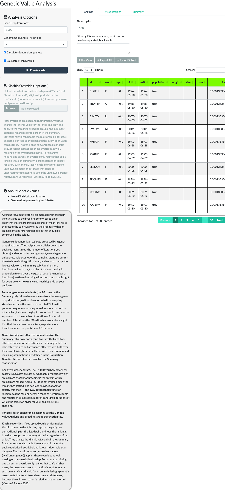{fig-alt="Genetic Value Analysis results table widened to 500 rows, showing the transition from High Value to Low Value and Undetermined animals sorted to the bottom."}

### Summary Statistics

The **Summary Statistics and Plots** tab uses the results from Genetic Value
Analysis. Definitions of genome uniqueness and kinship are on the **Genetic
Value Analysis and Breeding Group Description** tab; founder-equivalent and
founder-genome-equivalent definitions are at the bottom of this tab (see also
["Validating the Founder-Genome-Equivalent Standard
Error"](fg-se-validation.html)).

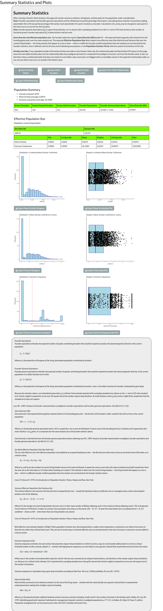{fig-alt="Summary Statistics tab showing the first view of genetic diversity metrics."}

The tab has several export buttons producing CSV files, three of which are
illustrated below (opened in a spreadsheet program, not captured from the app
itself, since these depict exported file contents rather than application
UI): **Export Kinship Matrix**, **Export First-Order Relationships**, and
**Export Female Founders** (a separate **Export Male Founders** button
produces the same column structure for males). The tab also has **Export All
Relationships** and **Export Relationship Classes** buttons, plus six further
buttons for exporting the six summary plots below as PNGs, not illustrated
here:

- The kinship matrix has a row and column for every analyzed individual, plus
  a first row and first column of IDs.

  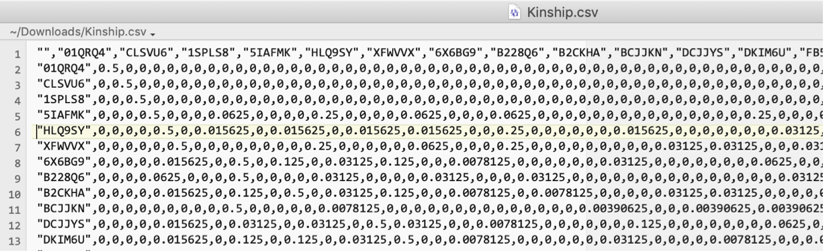{fig-alt="Spreadsheet view of an exported kinship matrix CSV file."}

- The first-order relationships file has columns `id`, `parents`,
  `offspring`, `siblings`, and `total`, counted from known relationships.

  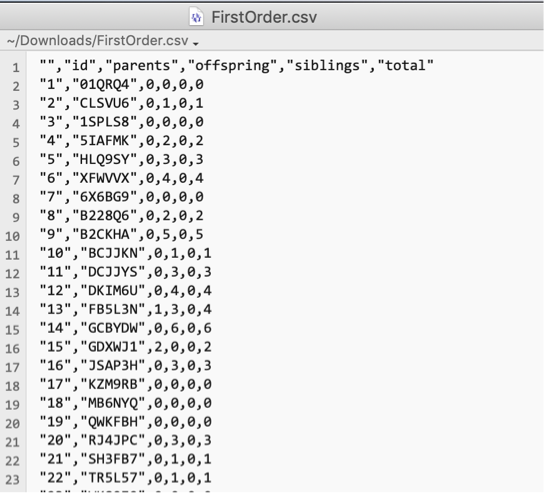{fig-alt="Spreadsheet view of an exported first-order relationships CSV file."}

- The founders files have columns `id`, `sire`, `dam`, `sex`, `gen`, `birth`,
  `exit`, `age`, `ancestry`, `origin`, `status`, `recordStatus`, `population`,
  and `pedNum`.

  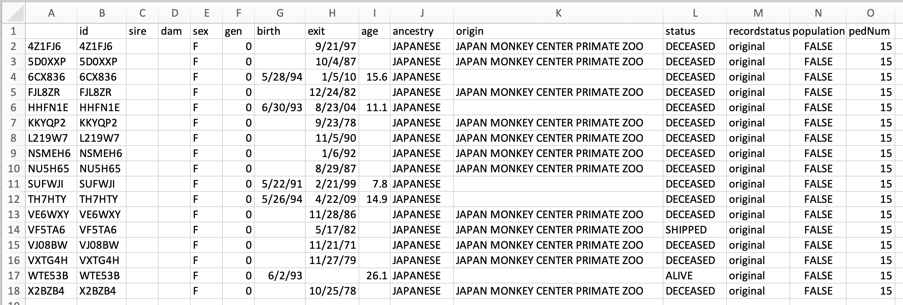{fig-alt="Spreadsheet view of an exported female-founders CSV file."}

Six plots -- histograms and boxplots of kinship coefficients, their Z-scores,
and genome uniqueness scores -- are shown together and can each be exported
as a PNG.

{fig-alt="Six summary plots: histograms and boxplots of kinship coefficients, Z-scores, and genome uniqueness."}

{fig-alt="Exported mean kinship coefficient histogram plot."}

### Breeding Group Formation

The **Breeding Groups** tab forms candidate breeding groups from a source
population you choose (top-ranked animals from Genetic Value Analysis, an
uploaded list, or all available animals), subject to a maximum kinship
threshold, a target number of groups, and a minimum breeding age.

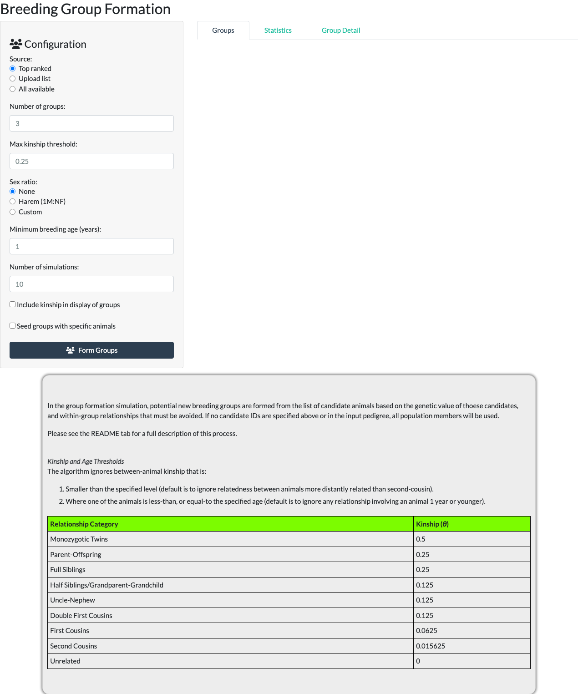{fig-alt="Breeding Group Formation tab showing the configuration panel: source, number of groups, kinship threshold, sex ratio, and minimum age."}

Selecting **Form Groups** with the number of groups set to 1 produces a
single group under the **Groups** sub-tab.

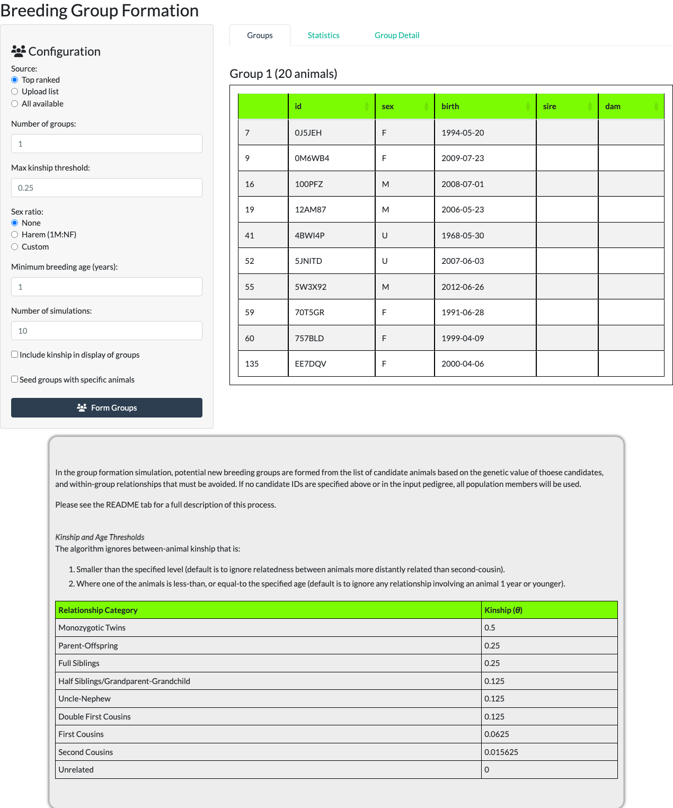{fig-alt="Breeding Group Formation results showing one formed group."}

**Sex ratio.** Three options control how each group's sex composition is
constrained:

- **None** -- sex is not considered when filling groups.
- **Harem (1M:NF)** -- each group is seeded with a single male and filled
  with females.
- **Custom** -- a "Custom ratio (F per M):" numeric field appears (default
  1.0, range 0.5-20.0) targeting an arbitrary females-per-male ratio.

::: {.callout-note}
**Fixed before publication.** An earlier draft of this walkthrough found
selecting "Custom" gave no way to enter the desired ratio anywhere in the UI
-- internally it was treated the same as "None." **Fixed** by adding the
numeric field described above; group formation now uses that value as the
target ratio.
:::

The screenshot below shows one working example: the default 20 top-ranked
candidate animals, a target ratio of 2.5 females per male, and "Number of
groups" set to 6. Because group formation is a randomized search (the
default **Number of simulations** is 10), the exact number and composition
of groups formed varies from run to run rather than reproducing identically
-- this particular run produced 7 groups, each drawn toward the target ratio
where enough candidates of each sex were available.

{fig-alt="Breeding Group Formation Groups sub-tab showing 7 groups formed in one run using a Custom sex ratio of 2.5 females per male; the exact group count and composition vary between runs."}

**Seeding groups with specific animals.** Behavioral constraints -- an
existing social group, or an infant that should stay with its dam -- can be
accommodated by checking **Seed groups with specific animals**, which opens
one text area per group for listing the animals that must be assigned to it;
the algorithm fills in the remaining membership around those seeds. The
screenshot below shows the six text areas this creates for a 6-group run,
before any IDs are typed into them.

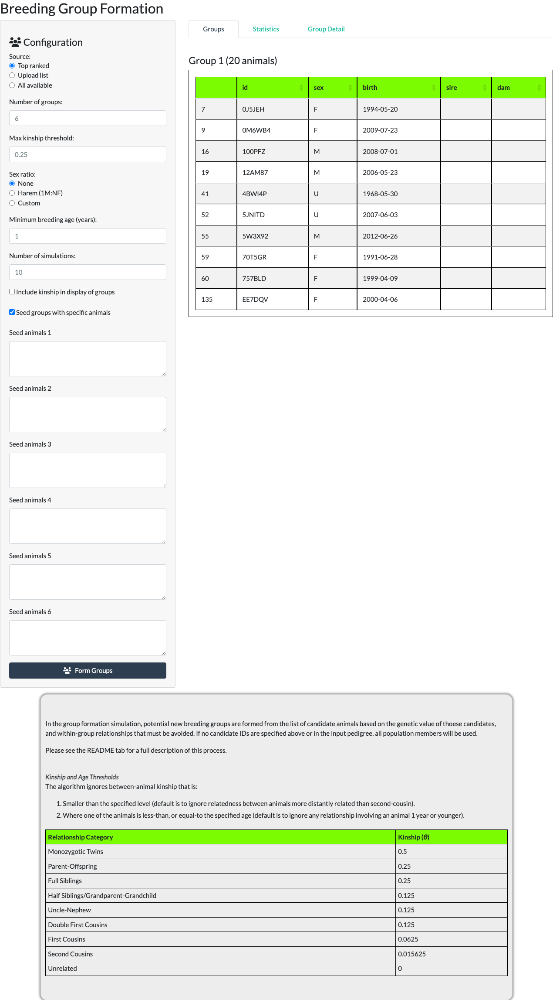{fig-alt="Breeding Group Formation showing six empty per-group seed text areas for a 6-group run."}

Each formed group's full membership, and -- if **Include kinship in display
of groups** was checked before forming -- its within-group kinship values,
can be reviewed on the **Group Detail** sub-tab, one group at a time.

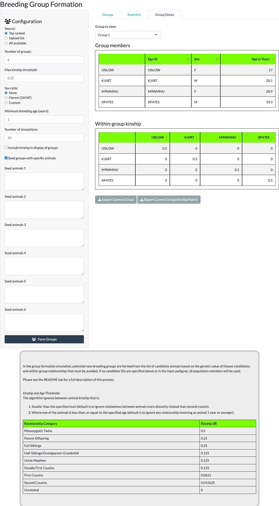{fig-alt="Group Detail sub-tab showing one formed group's membership without kinship values."}

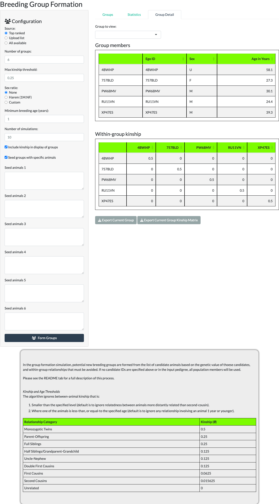{fig-alt="Group Detail sub-tab showing group membership with within-group kinship values included."}

A **Statistics** sub-tab summarizes all formed groups at once. Groups and
their kinship matrices can each be exported individually to a file and
location you choose.

### Genetic Diversity

The **Genetic Diversity** tab (issue
[#112](https://github.com/rmsharp/nprcgenekeepr/issues/112)) is new since the
package's original tutorial-era documentation. It monitors the diversity of
breeding groups *after* they are formed: once groups exist (Breeding Groups
tab) and a Genetic Value Analysis has been run, it renders a red/yellow/green
heat map with one row per group and one column per metric -- **Value** (the
proportion of low-value animals in the group), **Origin** (Indian- vs.
Chinese-origin status, shown only when the pedigree has an `ancestry`
column), **Production** (whether age-appropriate breeding females are present
for the selected **Housing type**, "Shelter pens" or "Corral"), and
**Inbreeding** (within-group kinship risk involving the group's male). A
group with no assessed value, or an undefined Inbreeding result, is scored
red rather than shown as healthy, so missing data surfaces instead of hiding
as a false green. Until groups are formed and an analysis has run, the tab
shows guidance instead of an empty plot.

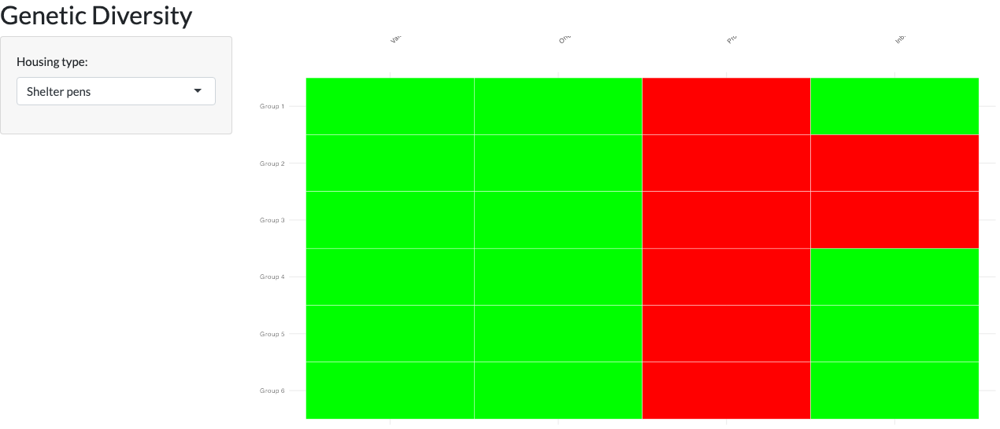{fig-alt="Genetic Diversity heat map with 6 rows (one per breeding group) and 4 columns (Value, Origin, Production, Inbreeding), each cell colored red, yellow, or green."}

### Potential Parents

The **Potential Parents** tab (issue
[#48](https://github.com/rmsharp/nprcgenekeepr/issues/48)) is also new since
the original tutorial-era documentation. It proposes candidate sires and dams
for in-colony animals recorded with at least one unknown parent, screening
candidates by estimated conception date (birth date minus a **Maximum
Gestational Period** in days -- prefilled from the pedigree's recorded
species, e.g. 210 days for rhesus, and adjustable) and by the same minimum
sire/dam breeding ages set on the Input tab. Results are shown in a
sortable table and downloadable as CSV.

::: {.callout-note}
**Fixed before publication.** An earlier draft of this walkthrough found the
shipped `data(examplePedigree)` had no `fromCenter` (colony-origin) column,
which this feature requires to identify which animals are in-colony
candidates versus animals whose origin is unrecorded -- so this section
could only show the application's own correctly-degraded empty-result
response rather than a populated example. **Fixed** by deriving a real
`fromCenter` column for the shipped example pedigree from its existing
`origin`/`recordStatus` fields; the screenshot below now shows real results.
If your own pedigree is missing this column, you will see that same
correctly-degraded response instead of the populated table below.
:::

Selecting **Find Potential Parents** against the full example pedigree
reports "Found candidate parents for **1,587** animal(s) with at least one
unknown parent," in a sortable, paginated, CSV-downloadable table.

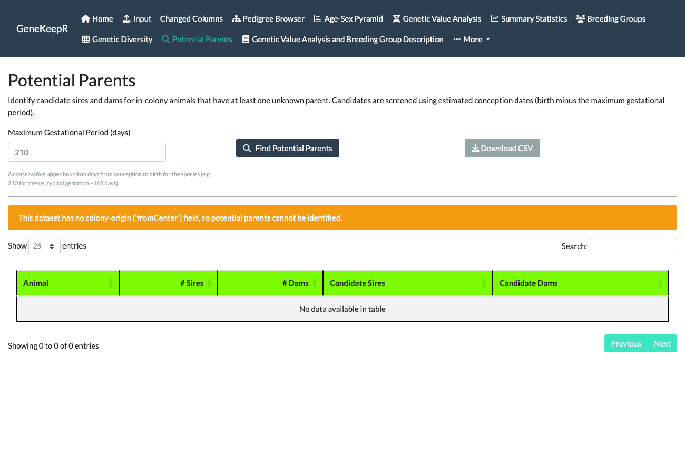{fig-alt="Potential Parents tab showing a results table of candidate sires and dams for 1,587 animals with at least one unknown parent."}

## Conclusion {#sec-conclusion}

This article covered why `nprcgenekeepr` exists, how its five function groups
map onto the Shiny application's tabs and onto a scriptable R API, and what
it looks like to actually use every tab of that application against the
package's own example data. For more depth on any one capability, see the six
feature articles in @tbl-function-groups; for the story of how the current
modular application came to be, see ["Engineering nprcgenekeepr
2.0.0"](engineering-the-2.0.0-release.html). This article's own preparation
surfaced and fixed three production issues along the way -- an Excel-upload
sire/dam corruption defect, a non-functional "Custom" breeding-group sex
ratio, and a shipped example pedigree missing the column the Potential
Parents tab needs to demonstrate populated results -- each described where it
arose in Section 3. Please report any further questions, comments, or bugs
through the [GitHub issue tracker](https://github.com/rmsharp/nprcgenekeepr/issues).

This work has been supported in part by NIH grants P51 RR13986 to the
Southwest National Primate Research Center and P51 OD011092 to the Oregon
National Primate Research Center.
