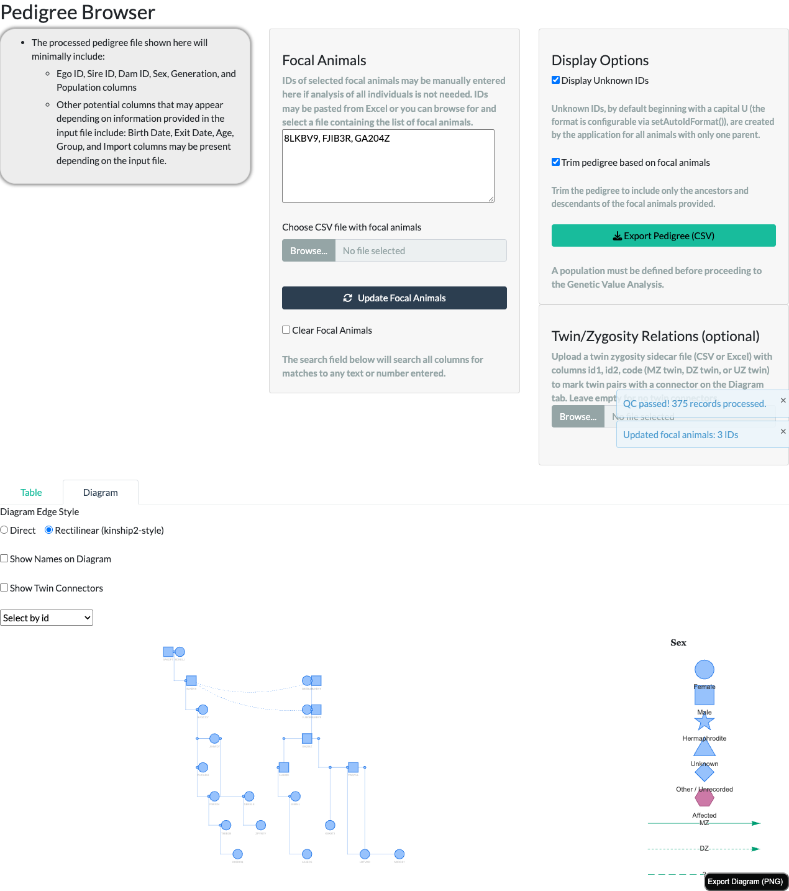
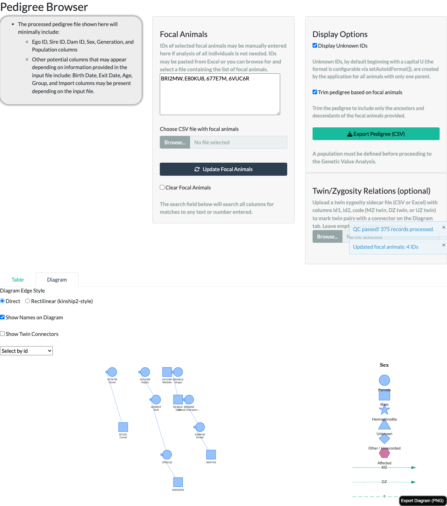
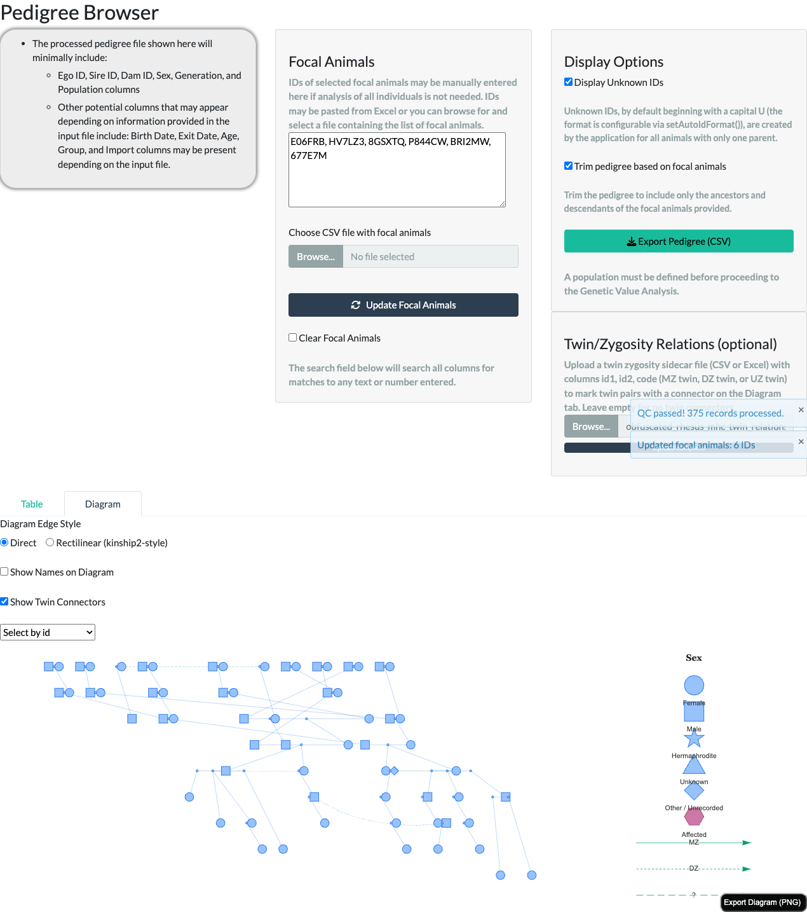

```{r}
#| label: setup
#| include: false
knitr::opts_chunk$set(collapse = TRUE, comment = "#>")
```

## Overview {#sec-overview}

The Pedigree Browser's **Diagram** tab renders a pedigree as an interactive
family-tree diagram, following the same mating-unit convention traditional
pedigree charts (and the `kinship2` R package) use: a mate's own matings
render as a small connector between the two parents, with a line down to
their shared children, rather than two independent lines running straight
from each parent. This article walks through everything the tab shows and
every control above it, using the Shiny app (`runGeneKeepR()`) directly.

Two related resources cover the same feature from other angles:

- The **Colony Manager's Guide** article's "Diagram view" section places this
  tab in the context of the full Pedigree Browser -- Table view, focal-animal
  trimming, and export -- for a reader working through the app tab by tab.
- The **Interactive Use of nprcgenekeepr** vignette's "Pedigree Diagram"
  section shows the same rendering built entirely from R, script by script,
  via the two exported functions this tab is built on
  (`makePedigreeMatingLayout()` and `visNetwork::visNetwork()`) -- useful
  outside the Shiny app, e.g. for a reproducible report or a custom app.

## Node shapes and the legend {#sec-shapes}

Every animal is one node, shaped by sex: dot = Female, square = Male, star =
Hermaphrodite, triangle = Unknown, diamond = Other/Unrecorded. A legend to the
right of the diagram shows the same mapping, so it never has to be memorized.

{fig-alt="Pedigree Browser Diagram tab showing a small interactive pedigree diagram with sex-shaped nodes and a shape-to-sex legend panel (dot=Female, square=Male, star=Hermaphrodite, triangle=Unknown, diamond=Other/Unrecorded, hexagon=Affected) to the right of the diagram."}

Diagrams render up to **750 animals** -- for a larger population, narrow the
focal-animal selection first (the **Focal Animals** panel to the left of the
diagram; see the Colony Manager's Guide article for the full trimming
workflow). The limit drops to **400 animals** when the Rectilinear edge style
below is selected, since that style renders more total diagram nodes per
animal (invisible routing waypoints, described there).

An animal that mates more than once, or whose lineage loops back on itself
(e.g. a consanguineous mating), appears once per mating; each occurrence
after the first is joined back to its main occurrence by a curved, dashed
line -- visible near the top of the screenshot above, where `8LKBV9` appears
twice. Hovering, clicking, or searching any occurrence behaves identically to
the animal's main occurrence ("Interacting with the diagram" below).

## Diagram Edge Style: Direct vs. Rectilinear {#sec-edgestyle}

A **Diagram Edge Style** toggle above the diagram switches the parent-to-
mating-to-child connector between two routings: **Direct** (the default --
a single straight or lightly sloped line all the way from parent to mating
dot to child) and **Rectilinear (kinship2-style)** -- strict horizontal/
vertical right angles throughout: a horizontal segment between the two
parents, a vertical drop to the mating dot, a horizontal bar across the
children, and a vertical drop into each one.

{fig-alt="Pedigree Browser Diagram tab with the Rectilinear edge style selected, showing the same pedigree routed with horizontal and vertical right-angle connectors instead of straight lines."}

Both styles show the exact same animals and relationships -- the difference
is purely routing. Rectilinear achieves its right angles with extra,
invisible "waypoint" nodes and edges (zero size, transparent), which is why
its own display cap is lower (400 vs. 750 animals) for the same visual
complexity.

## Consanguineous mating marker {#sec-consanguineous}

When a mating pairs two blood-related animals (their kinship coefficient is
greater than zero), the two connector lines joining that pair to their
shared mating point render thicker and in a distinct, colorblind-safe
vermillion (`#D55E00`) -- the doubled/thickened mate-line convention
traditional pedigree charts use to flag a consanguineous mating at a glance.
This marker needs no optional column and no toggle -- it is detected
directly from the pedigree's own sire/dam data, via the same kinship
computation the rest of the package uses (including any uploaded
Twin/Zygosity Relations file described below, for correctness parity). It
applies under both edge styles above.

The marker is a real, if visually subtle, cue: the two marked segments sit
immediately between each parent's own icon and the small mating dot next to
it, so in a dense, busy diagram it can be easy to miss at a glance even
though it renders correctly -- the bundled 375-animal example fixture used
elsewhere in this article has 28 such consanguineous unions, each
contributing its own pair of marked segments. Looking for a specific known
relationship, or zooming into one region of a large diagram, makes it much
easier to spot than scanning the whole population at once.

## Affected-status shading {#sec-affected}

If the pedigree data includes an optional `affected` column, an individual
marked affected renders filled with a distinct color (`#CC79A7`), with a
matching "Affected" entry in the legend; individuals marked unaffected, or
with unknown/missing affected status, render open/unfilled (white) --
matching the standard pedigree-drawing convention that only a filled node
means "affected." Pedigrees without an `affected` column render every node
unshaded, as before.

{fig-alt="Pedigree Browser Diagram tab showing three individuals: one filled magenta node (affected), and two open/unfilled white nodes (one unaffected, one of unknown affected status)."}

## Showing names {#sec-names}

If the pedigree data includes an optional `name` column, a **Show Names on
Diagram** toggle above the diagram (off by default) switches each node's
label from id-only to id plus name on a second line. A name longer than 15
characters is truncated with an ellipsis on the diagram itself, with the
full name always available in the hover tooltip (see "Interacting with the
diagram" below). Not every animal needs a name -- one with no name, or a
pedigree with no `name` column at all, always renders with just its id, and
the **Select by id** search dropdown below always lists ids, never names,
regardless of the toggle.

{fig-alt="Pedigree Browser Diagram tab with Show Names on Diagram enabled, showing several nodes labeled with both id and name, including one long name truncated with an ellipsis."}

## Twin/zygosity relations {#sec-twins}

If a colony records twin births, an optional **Twin/Zygosity Relations**
file can be uploaded from the panel to the right of the focal-animal
controls -- a CSV or Excel file with `id1`, `id2`, and `code` columns
(`code` one of `"MZ twin"`, `"DZ twin"`, or `"UZ twin"`), following
`kinship2`'s own twin-code convention. A malformed or inconsistent file (an
id not in the pedigree, or a declared MZ/DZ pair that does not already share
both sire and dam) is rejected with an on-screen notification rather than
breaking the diagram; the pedigree renders exactly as it would with no twin
data at all until a valid file is supplied.

Once uploaded, a **Show Twin Connectors** toggle above the diagram (off by
default) draws a distinctly-styled connector line directly between each
declared pair's own diagram nodes, in a colorblind-safe bluish-green
(`#009E73`): solid for a monozygotic (MZ) pair, short-dashed for a
dizygotic (DZ) pair, and long-dashed with a "?" label for a pair of unknown
zygosity (UZ) -- a callback to `kinship2`'s own "?" glyph -- with a matching
legend entry so the styling is discoverable without hovering over a
connector.

{fig-alt="Pedigree Browser Diagram tab with Show Twin Connectors enabled, showing a bluish-green dashed connector line drawn directly between two nodes representing a declared dizygotic twin pair."}

**Uploading this file does more than draw connectors.** A declared
monozygotic (MZ) pair's kinship is corrected to genetic identity throughout
the application, not just on this diagram. Once uploaded, the correction is
reflected in **Summary Statistics**, **Breeding Group Formation**, and
**Genetic Value Analysis** -- including for every relative reached through
either twin, not just the pair itself -- no matter which of those tabs is
visited first or whether the **Show Twin Connectors** toggle above is ever
switched on (that toggle controls only this diagram's own rendering). DZ and
UZ pairs are unaffected by this correction; only a declared MZ pair's
kinship changes.

## Interacting with the diagram {#sec-interacting}

- **Hover** any node to see its ID, sex, generation, sire, dam, and (when
  present) affected status, without leaving the diagram.
- **Click** a node to re-center the population on that animal, the same as
  typing its ID into the focal-animals text area -- a quick way to explore a
  different branch of the pedigree. Clicking a duplicate occurrence (see
  "Node shapes and the legend" above) resolves to the same animal as clicking
  its main occurrence.
- **Select by id** -- the dropdown above the diagram -- jumps straight to one
  animal by ID, dimming every other node except it and its direct
  connections, useful for finding one animal in a large, busy diagram.
- **Export Diagram (PNG)** -- the button in the diagram's own corner -- saves
  the current view as an image file, useful for husbandry reports, IACUC
  documents, or presentations.

## Script-callable equivalent {#sec-scripting}

Everything this tab renders is built on two exported, script-callable
functions that work identically outside the Shiny application:
`makePedigreeMatingLayout()` prepares a pedigree's node/edge data in the
mating-unit convention this whole article describes (including the
`edgeStyle`, `twinRelations`, and consanguineous-marker behavior above), and
`visNetwork::visNetwork()` renders it. A simpler function,
`makePedigreeDiagramData()`, remains available for a plain one-node-per-
animal diagram without the mating-unit convention -- it is no longer what
the Shiny app itself uses.

See the "Pedigree Diagram" section of the **Interactive Use of
nprcgenekeepr** vignette for a full, runnable walkthrough -- both edge
styles, the node/edge data structure, and the twin-relations argument, all
reproducing this tab's rendering exactly (including a genuinely working
Export Diagram (PNG) button).

## See also {#sec-seealso}

- The **Colony Manager's Guide** article -- the Diagram tab in the context of
  the full Pedigree Browser tab (Table view, focal-animal trimming, export)
  and the rest of the application.
- The **Interactive Use of nprcgenekeepr** vignette -- the same diagram,
  built step by step from R.
- `makePedigreeMatingLayout()` -- prepares the node/edge data this tab
  renders.
- `makePedigreeDiagramData()` -- the simpler, one-node-per-animal alternative.
- `checkTwinRelations()` / `readTwinRelations()` -- validate and read a
  Twin/Zygosity Relations file.
- `kinship()` -- pairwise kinship coefficients from a pedigree, including the
  `twinRelations` correction described above.
- `runGeneKeepR()` -- the Shiny app that hosts this tab.
